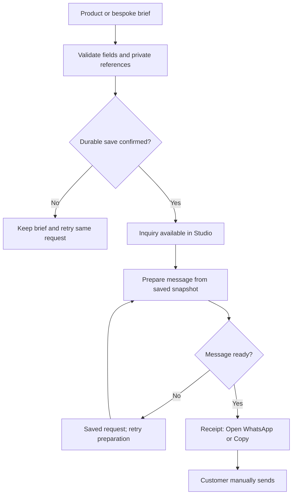

# RivyaLivingArt — Dark Theme Audit & Phased Implementation Plan

**Prepared for Bhavya Gondaliya · 26 September 2026 · Revision 1.0**

**STATUS: PLAN READY — WAITING FOR APPROVAL. NO IMPLEMENTATION STARTED.**

This is an initial integrated source audit, sampled live design review, and implementation specification. It does not certify every deployed page, authenticated Studio screen, or business operation. Repository, production, database, and Drive content have not been modified. The accompanying `RivyaLivingArt-Dark-Theme-Master-Prompt.md` is the reusable execution brief.

## 1. The recommended direction

Continue **RivyaLivingArt2.0 as the production codebase**. Use **OLDWEBSITE as a reference and selective feature donor**. Restore the older site's useful content, page patterns and staff tools through the current application's data and permission contracts. Do not replace the production repository with the older project or merge its database/authentication implementation wholesale.

Create one fully dark identity for the storefront and staff Studio, built around **forest #101713 + midnight blue #08111D**. Retain **#19221C** as a supporting forest surface. Make the forest-to-blue gradient the primary brand gradient; keep bronze as a restrained accent. Photography may contain light areas, but navigation, page backgrounds, editors, dialogs, tables, forms, loading states and system pages remain dark.

The live desktop homepage already uses the requested green header and blue canvas. Current source also contains these tokens, product-specific forms, persistent inquiry code, private references, roles and Kanban. The work is an extension and verification programme, not a fresh implementation of all these features.

The business remains an inquiry-led atelier: no payment gateway, checkout or customer accounts. Website orders mean **order requests**, saved to the database and visible in Studio before an order-specific WhatsApp message is offered. The customer manually sends that message. Opening WhatsApp never means the order was confirmed or the message delivered.

## 2. Verified baseline and audit boundaries

| Source | Observed baseline | Evidence level |
|---|---|---|
| Production repository | `rivyalivingart2/RivyaLivingArt2.0`, default branch `main`, SHA `3c88c24cc2d19444aa8ec9e891b3c67c2ab39a04` | GitHub metadata, complete recursive tree and selected source files read |
| Reference repository | `rivyalivingart2/OLDWEBSITE`, default branch `main`, SHA `2dd6d5de34acf3f98e611eda2e1b858ebd0da8e6` | GitHub metadata, complete recursive tree and selected source files read |
| Current public website | Homepage, River Channel detail, and its customization entry inspected in Chrome; viewport 1363 × 936 CSS px | Live DOM and homepage screenshot; no submission |
| Current Studio | `/studio` reaches staff sign-in | Live DOM; no authenticated session inspected |
| Older public website | Homepage inspected, including hero, chapter links and header WhatsApp destination | Live DOM and screenshot |
| Older Studio | `/studio/` redirects to staff login with email/password and recovery link | Live DOM; dashboard not authenticated |
| Design references | All five requested homepages opened; screenshots and/or DOM read | Desktop sample; deep pages, mobile and motion timings not comprehensively tested |
| Awwwards | Ekomia, Case Furniture and GET listing descriptions retrieved | Search-index evidence; listing fetches timed out; no live usability certification |
| Drive | Master folder and seven descendant folder listings read | Metadata inventory; asset pixels, rights and all nested files not exhaustively reviewed |
| Deployment provenance | Live appearance corresponds to source patterns | Exact active Vercel deployment SHA was not independently verified |
| Git access | Connector reports `pull: true`, `push: false` for both repositories | A later release requires an authorized writable connection; not a blocker for this plan |

No production inquiries, reference uploads, WhatsApp messages, migrations, builds, security probes, database queries, role changes, or deployments were performed. Mobile, real-device, screen-reader and performance results below are **acceptance targets**, not measured results.

### Evidence labels used throughout

- **Observed:** verified in this audit's live browser or current source.
- **Recorded:** stated by repository documents; not independently rerun here.
- **Proposed:** intended design or implementation work.
- **Unverified:** requires further inspection or runtime testing.

### Current versus older architecture

| Area | Current repository | Older repository | Decision |
|---|---|---|---|
| Framework declarations | Next `16.3.5`, React `19.3.0`, Tailwind `4.3.3`, TypeScript `5.9.3`; Node 22 constraint | Next `^16.3.1`, React `19.2.4`, Tailwind `^4` | Retain current pins; these are package declarations, not installed-runtime measurements |
| Data implementation | `@neondatabase/serverless`, SQL helpers and `rivya_*` records | Prisma schema, PostgreSQL adapter | Adapt selected features to current persistence; no ORM migration for visual work |
| Staff access | Custom server sessions, `admin` and `editor`, assigned-inquiry checks | Auth.js and staff user models | Preserve current session and authorization boundaries |
| Public rendering | `src/components/shop/*`, route-owned shells | Localized `src/app/[locale]/(v2)/*`, storefront components | Preserve current URLs; map older paths explicitly |
| Studio rendering | `src/components/studio/workspace.tsx`, module dispatch through catch-all route | Many individual dashboard page files | Extend current workspace deliberately; do not copy old pages without adapters |
| Media | Public media records plus separate private customer references; Vercel Blob dependency | Blob/storage abstractions and broader media tooling | Preserve privacy split and original masters |
| Animation | Current presentation uses restrained CSS motion | GSAP, Lenis and Three dependencies declared | Reuse patterns only where useful; no automatic dependency transplantation |
| Localization | Current root declares English | `next-intl` and localized routing; older docs describe nine locales | Treat multilingual restoration as an explicit scope decision, not silently completed |

## 3. Source reconciliation: what changes in the brief

| Conflict or older instruction | Selected direction |
|---|---|
| Older prompt asks to choose a dark blue compatible with #19221C | Latest user selection is final: #101713 and #08111D are the two primary anchors; #19221C remains supporting |
| Current `--brand-gradient` is bronze; canvas gradient uses #0B1728 rather than the exact requested blue stop | Reassign the primary brand gradient to forest → midnight; give bronze its own accent token |
| Older light/mineral sections | Reinterpret their spacing, hierarchy and image treatment on dark surfaces across public and Studio |
| “Implement old needed things” could imply replacing the application | Use the route/feature disposition registers below. Restore useful capabilities while retaining current data contracts |
| Old guide opens WhatsApp automatically and exposes public reference URLs | Preserve current saved receipt, explicit Open/Copy, manual Send, and private reference access |
| Old guide contains a different WhatsApp number | Do not copy the old number. Read current server-owned business settings; current public phone is +91 83204 04132, but that alone does not prove the saved WhatsApp destination |
| Old header offers generic WhatsApp chat | Exclude it. Header CTA routes to catalogue/customization or `/commission`; WhatsApp only follows a saved order request |
| Older documents say forms, staff, and persistence are demo-only | Current action, schema, session and Kanban source supersede that diagnosis. Verify the deployed implementation before changing it |
| Old repository contains scraping, subscribers and extensive research modules | Do not reactivate them by inheritance. Current instructions exclude general messaging; active project guidance excludes scraper/continuous Sheets-sync work. Keep these separately scoped |
| Older plans impose Vercel Hobby/free-only constraints | Later project records report Vercel Pro. Do not repeat the old free-only release block; verify current project settings before deployment |
| Earlier docs lack Indian delivery, retention, timezone and recovery policies | `docs/decisions/2026-09-24-operating-policies.md` records owner decisions. Reuse them and verify implementation rather than inventing or re-requesting them |
| A prior release note says production unchanged; live site now has similar dark presentation | Treat that note as historical. Record current main and live observations separately; verify exact deployment at release |
| “No placeholder text” versus generated product imagery | Remove dummy/test content; preserve truthful “design visualization” disclosure where warranted. Relabelling a concept as a completed product is not content completion |
| Historical approvals in repository | This turn explicitly requests a plan before execution. Earlier authorizations do not start this new redesign automatically |

The two exact filenames `RivyaLivingArt-Experience-Implementation-Plan.md` and `RivyaLivingArt-Design-and-WhatsApp-Order-Plan.md` were not found in either current repository tree or as exact Library matches. Their contributions are described in the current commercial master. This plan reconciles that successor, its progress/pending records, the Midnight Atelier report, the earlier CRAFT master, the WhatsApp reference guide, current code and the latest user request. It does **not** claim to have read missing originals.

## 4. Findings and priority register

| ID | Requirement / finding | Current evidence | Work and priority |
|---|---|---|---|
| D01 | Full dark storefront | Homepage rendered navy/forest; shared dark CSS exists | PARTIAL verification. Audit every route and state; P1 |
| D02 | Full dark Studio | Dark tokens/workspace CSS and login source exist | PARTIAL verification. Authenticated screen/state audit remains; P1 |
| D03 | Exact primary gradient | #101713 and #08111D exist, but `--brand-gradient` is bronze | CHANGE: explicit forest–midnight primary, separate bronze accent; P1 |
| D04 | Header size and legibility | Live desktop header measured 84px with ivory text on #101713 | Already improved. Do not label it universally broken; validate long labels/tablet/zoom and compact to target if needed; P1 |
| D05 | Product-specific customization | River Channel has room/use, dimensions, colour, finish, seating, city and access fields | Already present. Complete capability-specific controls and verify every family; P1 |
| D06 | Database before WhatsApp | `placeInquiry` validates schema, persists and then finalizes message | SOURCE IMPLEMENTED. Preserve; runtime failures/concurrency coverage needed; P0 |
| D07 | References and staff Kanban | Current board and detail include assignments, stages, reference access and version checks | SOURCE IMPLEMENTED. Improve usability and close runtime gaps; P0/P1 |
| D08 | Public copy still exposes internals | Homepage process text mentions “database and Studio” | Rewrite customer copy around “saved brief”; keep internals in staff/docs; P1 |
| D09 | Repeated imagery | Homepage sample uses River Channel for hero, material block and multiple journal thumbnails | Curate distinct supplied assets per story; P1 |
| D10 | Legacy feature parity | Old tree has richer CMS, catalogue and workflow routes | Selective restoration register required; P1/P2 |
| D11 | End-to-end CMS editability | Current ShopHeader has hardcoded navigation arrays; homepage includes composition/copy in source | Trace every editable field. Add safe content bindings where missing; P1 |
| D12 | Legacy operational content | Older homepage shows generic WhatsApp CTA, broad 7-days–6-weeks text and “0 commissions documented” | Do not transfer these blindly; use current settings and supported claims; P1 |
| D13 | Full commercial readiness | Pending-work file lists remaining device, runtime, media, recovery and release checks | UNVERIFIED. Close actual gaps; do not call deployment a readiness certificate; P0 |
| D14 | SEO | Records say indexing disabled; source uses indexing flag | Verify live robots/canonical/sitemap and intentionally release indexing only after public QA; P1 |
| D15 | Deployment permissions | Current connector read-only | Resolve at final publication, without broadening permissions for this audit |

P0 = protects the saved-order, private-data or release contract. P1 = required redesign/parity scope. P2 = optional expansion after core acceptance.

## 5. Reference research translated into Rivya

These observations are landing-page samples, not full audits of every reference-site route. Proposed motion below is an original implementation specification; exact competitor timings were not measured.

| Reference | Observed pattern | Application to Rivya | Avoid / risk |
|---|---|---|---|
| [ERA Residence](https://www.era-residence.com/) | Immersive architectural image; tall display type; location/concept narrative and property categories; apartment/contact CTAs | Room-scale furniture imagery, deliberate chapter rhythm, restrained display type, category chapters | Do not copy the dominant brand typography, cookie treatment or property selection flow; preserve usable first-screen navigation |
| [Spyker](https://spykercars.com/) | Cinematic car presentation, minimal menu, detail/craft and heritage storytelling | One optimized resin-pour film, material macro details, clear craft sequence | No loading spectacle, hidden essential CTA, copied automotive content, cart or subscription behaviour |
| [AOI](https://aoiofficial.com/) | Split fashion/object hero, product categories, craft stories, limited-piece and commission content | Pair full-object and detail imagery; position pieces as considered objects; separate browse and commission entries | No copied scarcity claims, fashion taxonomy, account/cart or experience switch that confuses browsing |
| [Maison des Elites](https://mdebeauty.com/) | Structured brand principles, product/ingredient explanations; browser showed an opening preloader before content | A concise material/finish explainer with progressive detail; precise process captions | No blocking preloader, decorative delay before forms, beauty claims, rewards, account/cart modules |
| [Storey Architecture](https://www.storeyarchitecture.co.uk/) | Image-led residential hero, small direct navigation, project stories and a project-type/location/timeline brief | Space-first case studies, scale/context images, brief fields appropriate to installations | No invented client stories; keep typography and navigation legible over variable media |
| [Ekomia — Awwwards listing](https://www.awwwards.com/sites/ekomia) | Listing describes furniture UX, rich details and a 3D configurator | Rich details and useful configuration controls | Listing-only evidence; no assumption that a heavy 3D configurator is required |
| [Case Furniture — Awwwards listing](https://www.awwwards.com/sites/case-furniture) | Listing describes a customizable homepage and craftsmanship presentation | CMS-controlled editorial modules and product hierarchy | Do not inherit Shopify checkout assumptions |
| [GET — Awwwards listing](https://www.awwwards.com/sites/get-a-furniture-marketplace) | Listing describes an interior-first furniture marketplace journey | “In your space” context and room-led exploration within existing collection structure | No marketplace expansion or unnecessary extra navigation levels |

Use each reference for a specific design decision. Do not copy source code, brand marks, photography, copy or a complete composition. Maintain a benchmark ledger linking each selected pattern to a Rivya component, accessibility fallback, media cost and test.

## 6. Proposed design system: Forest × Midnight Atelier

### 6.1 Colour tokens

| Token | Value | Use |
|---|---|---|
| `--brand-forest` | `#101713` | Header, Studio sidebar, forest sections |
| `--brand-midnight` | `#08111D` | Main application canvas and deep reading surfaces |
| `--forest-raised` | `#19221C` | Secondary forest panels, selected backgrounds |
| `--surface` | `#111D22` | Cards and low-elevation panels |
| `--surface-elevated` | `#1D2D33` | Hover panels and secondary elevation |
| `--studio-panel` | `#112033` | Editors, drawers and data modules |
| `--text-primary` | `#F3EFE7` | Main copy and gradient-button labels |
| `--text-secondary` | `#B7BFB5` | Supporting text |
| `--accent-bronze` | `#B79270` | Dividers, icons, key emphasis |
| `--accent-bronze-hover` | `#CEAC89` | Hover emphasis |
| `--border` | `#465466` | Structural separators; not automatically sufficient for every control |
| `--control-border` | `#8B96A3` | Visible form/control boundaries |
| `--control-surface` | `#122336` | Inputs, selects and editable areas |
| `--focus-ring` | `#E6BA85` | Visible focus on dark surfaces |
| Success / warning / error | `#D6EADC` / `#F2D39B` / `#FFD1C5` | Text plus icon/label; never colour alone |

Proposed token specification, not an applied code change:

```css
:root {
  color-scheme: dark;
  --brand-forest: #101713;
  --brand-midnight: #08111d;
  --forest-raised: #19221c;
  --brand-gradient: linear-gradient(135deg,
    var(--brand-forest) 0%, var(--brand-midnight) 100%);
  --brand-gradient-hover: linear-gradient(135deg,
    var(--forest-raised) 0%, #112033 100%);
  --accent-gradient: linear-gradient(135deg,
    #b79270 0%, #ceac89 48%, #b08d57 100%);
}
```

The primary gradient belongs on hero text panels, commission bands, Studio login, selected navigation and primary brand controls. Because the anchors are both very dark, buttons need a clear border, spacing and high-contrast label. Do not rely on the gradient alone to show clickability. Keep most dense Studio tables and editors solid-colour for clarity. Bronze remains a supporting accent; it does not replace the requested green–blue identity.

Calculated solid-colour contrast ratios: ivory on forest **15.87:1**; ivory on midnight **16.52:1**; secondary text on raised forest **8.65:1**; bronze on midnight **6.64:1**; control border against control surface **5.30:1**. Forest against midnight is only **1.04:1**, so their transition is atmospheric, not a usable control boundary. These calculations do not certify overlays, transparency, hover/disabled states or all pixels of a gradient. Test rendered combinations against normal-text 4.5:1, large-text 3:1 and relevant non-text 3:1 targets.

### 6.2 Typography and spacing

Preserve the supplied logo and existing local Instrument Serif display / DM Sans UI pairing. Keep JetBrains Mono for identifiers and dates only. Do not stretch or recreate the logo. Use body fonts for Studio field labels, tables and navigation; limit serif display styling to page headings.

| Element | Proposed specification |
|---|---|
| Public H1 | `clamp(42px, 6vw, 88px)`; 1.0–1.08 line-height; deliberate wrapping |
| H2 | `clamp(32px, 4vw, 56px)` |
| Studio H1 | 28–36px; no oversized editorial title above working tools |
| Body | 16–18px; 1.55–1.7 line-height |
| Navigation / controls | 15–16px; normal-case labels; no excessive letter spacing |
| Metadata | 12–14px, sufficient contrast; never used for essential instructions |
| Container | 1440px maximum for general content; 64–72ch for articles/policies |
| Grid | 12 columns desktop, 6 tablet, 4 mobile; actual content stacks as needed |
| Gutters | 20px mobile, 32px tablet, 48–80px desktop |
| Section gaps | 56–72px mobile, 88–128px desktop; smaller inside forms/Studio |
| Touch controls | Design target at least 44 × 44px; standard fields 48px high |
| Radii | 2–6px controls/cards, restrained; consistent drawer/dialog corners |

### 6.3 Global shell and interaction rules

- Public header target: 76–80px desktop, 64–72px tablet/mobile, adjusted only after content-fit review. Current 84px is a measured baseline, not proof of a defect.
- Keep the established three collection journeys and current working destinations. Use “Our Atelier” for the brand page; reserve `/studio` for staff access to avoid the old label ambiguity.
- Use an opaque forest header as the default. A media overlay variant needs an invariant scrim, verified contrast and a solid open-menu state.
- Preserve keyboard menu/search behaviour, Escape, focus return, active state and no-JavaScript navigation. Never reduce text size merely to squeeze too many links into a row.
- Header CTA: “Begin a piece”; product CTA: “Customize this piece”; final form CTA: “Place Order” with “This submits a request; final design and quotation require confirmation.”
- Footer includes collections, atelier/process/journal, factual contact details, policies and accessibility. No general WhatsApp button.
- Dark mode covers browser theme colour, autofill, native controls where supported, tooltips, rich-text toolbar, toast, dialogs, gallery, skeletons, errors and session-expired screens. Do not build a light-mode toggle unless separately requested.
- Product photography keeps accurate colour. Do not tint all product images green/blue to match the UI.

### 6.4 Motion specification

| Motion | Proposed behaviour | Fallback / restriction |
|---|---|---|
| Section reveal | 400–550ms opacity/translate; 12–20px travel; stagger capped at 240ms total | Content visible with JS absent; immediate under reduced motion |
| Product hover | Scale at most 1.025; 200–300ms; only if a genuine alternate image exists | Touch users get explicit gallery controls |
| Menu/dialog | 180–240ms; focus handled immediately | No animation delay before keyboard use |
| Hero film | One muted inline loop with poster and pause; load after useful page content | Poster on reduced motion/data-saving preference or failure |
| Material chapter | Gentle image depth or sticky text only on wide screens if profiling passes | Normal document flow on mobile and reduced motion |
| Studio feedback | Short state changes, save feedback and optional drag feedback | No parallax, cursor effects or decorative reveals in operational screens |

No scroll-jacking or blocking preloader. Add a motion dependency only when CSS and the existing stack cannot satisfy an approved interaction at an acceptable cost.

## 7. Selective restoration from OLDWEBSITE

“Needed” means useful for the current business, backed by valid content/data, compatible with current security, and included in the approved scope. No source file, database row or legacy route is automatically publishable just because it exists.

| Legacy capability | Disposition | Implementation path / acceptance |
|---|---|---|
| Pour-led hero, chapter markers, craft/maker story | RESTORE DESIGN | Adapt as optional CMS sections; preserve clear product CTA and fast poster fallback |
| Large-format storytelling | RESTORE | Enrich `/collectible-design`, architecture briefs and genuine portfolio pages |
| Rich categories/search/filtering | RESTORE SELECTIVELY | Map old taxonomy to current three journeys; URL-state filters and accurate published counts |
| Product galleries, material details and customization controls | RESTORE DESIGN / EXTEND | Current product schema and gallery own the data; no copied fake options |
| Guest wishlist / saved pieces | CONDITIONAL | Only if useful and approved; browser-local product IDs, no account; no checkout semantics |
| Navigation, site copy, site images and section editing | RESTORE CAPABILITY | Safe typed content/settings records, drafts, preview, publication and revalidation |
| FAQs, process steps, materials and portfolio editing | RESTORE CAPABILITY | Extend current content workspace with typed editors and truthful publication checks |
| Product readiness / content-health views | RESTORE CAPABILITY | Derive status from actual missing fields/assets; click through to the exact fix |
| CSV/XLSX import/export | EVALUATE / RESTORE SAFE SUBSET | Preview diff, validation, deduplication, explicit publish; no automatic Google Sheets synchronization |
| Inquiry filters, table and Kanban | KEEP CURRENT + UX PARITY | Existing assignment/private reference/version model; all changes audited |
| Product Kanban | RESTORE IF NEEDED | Content readiness board separate from customer-order stages; publication uses existing validation |
| Research/scraper/confirmed-product tooling | DEFER | Separate scope; do not restart scraping or publish external products as part of this redesign |
| Newsletter/subscribers/WhatsApp marketing | EXCLUDE | Outside current order-only communication scope |
| Generic WhatsApp FAB/header/contact/share actions | EXCLUDE | Only saved-order Open/Copy survives |
| Workshops, supplies and 3D-printing promotion | CONDITIONAL | Restore only verified currently offered services/content; never invent dates, stock, capabilities or prices |
| Legacy locales | CONDITIONAL | Preserve redirects for known valuable URLs; native localized restoration requires reviewed translations and locale-specific QA |
| Staff signup/reset implementation | DO NOT COPY | Retain current admin-managed staff access; evaluate recovery needs separately without public self-enrolment |
| Prisma/Auth.js/GSAP/Lenis/Three stack | DO NOT TRANSPLANT | Reuse patterns and specifications, not an unrelated runtime architecture |

Maintain a `legacy-parity.csv` with source path, requirement, target route/module, disposition, data mapping, owner/content dependency, phase, acceptance evidence and status. The appendix below provides the starting route inventory.

## 8. Public page implementation matrix

All rows inherit the global dark shell, responsive/keyboard/reduced-motion requirements, truthful content rule, CMS field mapping, publication checks and page-specific metadata. The following is a target specification; only the sampled pages in section 2 were live-reviewed.

| Route / template | Target section order and old elements to bring forward | CMS / media requirement | Distinct acceptance criterion |
|---|---|---|---|
| `/` | Hero → three journeys → selected pieces → material story → craft/process → real project if available → journal → commission invitation | Hero media/poster/crops, headings, selected IDs, section order and visibility editable | Every CTA resolves; no duplicated generic thumbnail across unrelated stories; no developer copy |
| `/[collection]` — collectible design | Breadcrumb/introduction → room-scale feature → category/filter bar → piece grid → materials/process → brief CTA | Real published taxonomy, cards, room media and intro | Furniture remains leading journey; results/counts and URL filters agree |
| `/[collection]` — memory art | Preservation intro → appropriate occasions/forms → catalogue → preparation/process → care/timing → CTA | Preservation-specific copy, accurate examples | No furniture-only questions or guaranteed preservation outcomes |
| `/[collection]` — personal art | Gift/use intro → category/occasion filters → products → personalization explainer → CTA | Relevant text/image fields and product IDs | No forced consultation questions on simple personalization |
| `/search` | Search heading/input → query/count → filters/sort → grid → no-results suggestions | Published dataset; no invented search matches | Back/forward restores query and filters; mobile clear/apply works |
| `/pieces/[slug]` | Breadcrumb → gallery + title/summary → actual specs → options preview → material/care/delivery details → related pieces | Gallery/crop/alt, truthful description/specs, form schema relation | Related items are eligible; gallery works with one/many/missing images; CTA carries correct product |
| `/pieces/[slug]/customize` | Product context → choices → customer/reference details → review → request submit | Published versioned product form; explicit units/options/help | Correct schema per product; invalid/hidden/tampered answers rejected; no submission in this audit |
| `/commission` | Brief introduction → browse existing / create bespoke choices → process → scope and delivery reassurance → CTA | Bespoke content and category direction | Existing-item choice and custom request remain clearly distinct |
| `/commission/customize` | Bespoke category/use → dimensions/material direction → customer/references → review | Bespoke schema, conditional fields, actual supported capabilities | Product association stays null for a genuinely bespoke request; same persistence guarantees |
| `/inquiry/received` | Saved reference → message-preparation state → full summary → Open/Copy → next steps | Immutable saved request/message, authenticated guest receipt | No PII by guessed ID; reopening does not create another inquiry; no “message sent” claim |
| `/our-story` | Atelier introduction → factual origin/practice → craft/materials → people/workspace if genuine → process link | Genuine business history and approved photography | No fictional founder story, workshop photo presented as real, awards or experience claims |
| `/about` | Preserve existing behaviour; prefer current story alias if confirmed | Route mapping | Avoid competing duplicate story pages and canonical conflicts |
| `/process` | Brief → design review → agreed specification → making → finishing → delivery | Approved steps and realistic expectations | No generic WhatsApp entry; order-related communication accurately described |
| `/materials-care` | Materials introduction → wood/resin/finish guidance → care → limitations → related pieces | Verified material capabilities, care guidance and images | Anchor links work under sticky header; no unsupported safety/durability claims |
| `/materials` | Preserve/confirm alias or focused material page → material sections | Shared material content | No contradictory duplicated specifications |
| `/care` | Preserve/confirm alias or focused care page → care by material | Shared care content | Customer can find useful care without a dense animation sequence |
| `/architects` | Spatial use cases → actual collaboration process → brief requirements → project context → bespoke CTA | Installation/access requirements and real work | Professional brief feeds existing bespoke workflow; no new quote/payment system |
| `/preserve` | Preservation introduction → item types → handling/process → relevant catalogue/customization | Memory-art content | Existing destination/alias preserved; no duplicate unsupported form |
| `/personalize` | Personalization introduction → supported item types → relevant product/custom entry | Personal-art content | Supported fields remain attached to the selected product |
| `/portfolio` | Factual introduction → project filters if enough data → genuine case cards → commission CTA | Typed project model, rights, publication status | Empty state is honest; no fictional projects published to fill grid |
| `/portfolio/[slug]` | Project hero → brief/context → materials/scale → detail gallery → process/outcome → related work | Verified facts, credits and media permissions | Real work and conceptual studies clearly distinguished; invalid slug gives correct status |
| `/journal` | Editorial introduction → featured article → topics → article grid | Published article metadata, distinct covers | No fixture posts; pagination/filter works with actual data |
| `/journal/[slug]` | Title/deck/byline → cover → optional TOC → article → relevant piece/process links | Rich text, captions, accessible media and metadata | 64–72ch reading measure; sanitized content; no unsupported claims or copied benchmark prose |
| `/faq` | Topic groups → accessible questions → relevant route links | Editable factual Q&A | Keyboard toggles and deep links work; answers align with current policies |
| `/contact` | Verified contact/location → response expectations if approved → order-request direction | Server-owned contacts, real location/map | General contact has no generic WhatsApp shortcut; no fabricated response SLA |
| `/shipping-delivery` | Areas → feasibility → quotation factors → installation → timing | Existing approved Indian operating decisions | INR and PIN-code/serviceability wording consistent with current policy |
| `/returns-cancellations` | Before-production cancellation → changes → nonconformity → refund process | Existing approved policy content | No blanket invented refusal; visible version/date |
| `/privacy` | Data collected → purpose/access → retention → deletion/contact → reference treatment | Actual implemented policy and owner details | Matches private-reference and deletion behaviour; does not promise unimplemented controls |
| `/terms` | Request status → confirmation/quotation → custom specification → fulfilment → relevant policies | Approved business terms | No checkout/payment gateway or automatic production-booking implication |
| `/accessibility` | Accessibility approach → known limitations → assistance contact | Factual statement, dated review | Do not claim certification without evidence |
| Not-found / error / unavailable / loading | Clear state → safe action → navigation/retry | Shared state strings; optional restrained 404 media | No endless spinner, false saved state or lost form entries; appropriate HTTP behaviour |
| `/preview/states*`, `/preview/studio*` | Retain isolated development harness or retire only after dependency review | Fixture isolation | Not publicly indexable or a back door into working Studio; never treated as production CMS |

Potential older aliases: `/shop`, `/shop/[category]`, `/product/[slug]`, `/p/[slug]`, `/custom-order`, `/blog`, `/blog/[slug]`, `/large-resin-art`. Build a verified slug/category mapping before redirecting. Do not blanket-redirect all missing products or posts to the homepage. A missing counterpart needs a valid retained page, reviewed alternative, or truthful 404/410. Preserve historical inquiry receipt semantics privately; never pass old claim tokens to the new receipt handler without a deliberate compatibility design.

## 9. Product cards, catalogue and customization guide

### Discovery and media

- Stable card composition: image → product name → type/material cue → factual price basis or price on request → customization action. Avoid unsupported badges and false scarcity.
- Use consistent 4:5 product frames and wide editorial cards; retain the owner's recorded preference for images filling their frames. Use per-image focal points and extra gallery views so cover crops do not hide the product's shape or scale. Never stretch images; the logo keeps intrinsic proportions.
- Use one or two mobile columns based on readable titles and actual screen width, two/three on tablet and three/four on desktop. No horizontal page overflow. Long legacy catalogue names need concise display titles with original titles preserved in data where necessary.
- Filters reflect the published taxonomy and supported materials/options. No duplicate “all” categories or filters that always return zero because of bad mappings.
- A published item must resolve consistently on collection, search, direct URL, related modules and Studio preview. Drafts remain private; media changes trigger appropriate public revalidation.

### Forms by business family

| Family | Candidate fields, only where actually offered | Specific requirements |
|---|---|---|
| Furniture / spatial work | Use, dimensions and units, wood/material direction, resin direction, finish, base/seating, city/PIN, access/installation notes, preferred timing | Conditional dimension inputs; distinguish preferences from confirmed engineering/material specifications |
| Flower / memory preservation | Item type, frame/form/size, date/text if applicable, colour direction, reference images, location/timing | Do not promise flower-condition outcomes; expose handling guidance relevant to the item |
| Gifts / nameplates / accessories | Supported size, colour, engraving/name/text, quantity, occasion, required photo if applicable | Preview spelling exactly; validate length and options; no unnecessary furniture fields |
| Bespoke / 3D work if offered | Category, purpose, dimensions, supplied model/reference information, material/finish, quantity and timing | Only allow supported upload types. Current image-upload endpoint must not silently accept STL/ZIP/CAD; model files need separate scoped design |

Extend `product-form`, `inquiry-definition`, `inquiry-schema`, field-schema validation and Studio catalogue/form editing. Field records need stable IDs, type, label, required condition, valid choices/units, bounds, help text, ordering and version. Never execute arbitrary scripts from a form definition. Keep client rendering and server validation aligned. Form changes must not mutate historical saved answers.

The existing River Channel form is already product-specific, but many choices are deliberately consultative. Add richer selections only when the atelier genuinely offers and confirms them. No fabricated finish swatches, automated pricing or photorealistic configuration promise.

## 10. Canonical request → Studio → WhatsApp contract



Preserve the two-stage durable contract already present in current source:

1. Server validates a published product/schema or bespoke definition, guest ownership, idempotency key, normalized answers, contact details, consent and ready references.
2. Atomically persist canonical inquiry/order, immutable customization snapshot, linked references and initial history. Studio reads the same canonical record; no browser-to-browser acknowledgement is required.
3. Build and persist the versioned message from saved data. Keep message-preparation status independent from business Kanban stage.
4. Return an authorized receipt. Only a ready saved message exposes Open/Copy. A preparation failure must say the request was saved, rather than encourage a duplicate submission.
5. Customer chooses Open WhatsApp and presses Send. The platform does not observe send, delivery, read, reply, payment or fulfilment.

### Data that must survive

Request ID/reference; kind; product ID when applicable; immutable title/spec/form snapshot; schema/template versions; field-ID answers with labels, values and units; customer details; notes; private-reference IDs/count; consent/version/time; server-resolved source route; destination configuration snapshot; created/updated timestamps; staff assignment; stage/version/history; meaningful amendments with actor and reason.

### Message and reference policy

Use `src/lib/whatsapp.ts` and current server settings, never hand-built URLs in page components. Encode the message once. Preserve the current conservative URL budget and full-copy fallback until measured platform testing justifies change. Long Gujarati/Hindi text must be tested by encoded URL length as well as visible characters. The complete brief remains saved and copyable even if a compact reference-only link is used.

Customer references remain private. The current commercial plan sends a reference count, not public object URLs. Do not revert to the old guide's public-upload pattern. Any later external sharing must be a separately reviewed, scoped and expiring mechanism. `wa.me` does not attach files automatically.

### Failure acceptance

| Failure | Required behaviour |
|---|---|
| Invalid or outdated form | Explain affected fields/schema change; retain compatible input; no save/open |
| Upload interrupted or invalid | Per-file retry/remove; ownership and decoded MIME verified server-side |
| Database unavailable | Preserve input and stable request key; no success or WhatsApp action |
| Lost response after commit | Retry/read back same owned payload; exactly one saved request |
| Message finalization fails | Saved-pending receipt, same-record retry, authorized recovery; no duplicate inquiry |
| WhatsApp unavailable / popup blocked | Saved receipt with Open again and Copy; no second save |
| Session or receipt expired | Safe renewal/recovery without revealing another person's record |
| Staff editing conflict | Preserve local edits, explain conflict and reload current version; no silent overwrite |

No general WhatsApp support/chat/FAB, bots, campaigns, auto-follow-ups, notifications, account connection, synchronization or product-share feature is included.

## 11. Studio redesign and role-aware operations

The current production workspace has Overview, Inquiries & orders, Follow-ups, Catalogue & forms, Pages & journal, Public media, Activity, Staff access and Settings. Aliases exist for orders, kanban, forms, journal and pages. A catch-all page is not proof that every old module works. The production workspace and `/preview/studio` harness must remain distinct.

| Current destination | Target layout and functionality | Required evidence |
|---|---|---|
| `/studio/login` | Quiet forest–midnight canvas, legible form, password reveal, clear failure state | Dark autofill, focus, throttle/session handling; no customer login |
| `/studio` | Compact operational summary, recent requests, due follow-ups, content readiness, useful links | All counts from authorized real data; no decorative fake analytics |
| `/studio/inquiries` | Filterable board plus accessible list/table; useful cards; detail drawer | Search/filter/pagination/assignment and keyboard move work on same data |
| `/studio/follow-ups` | Due-today/overdue views and staff scope | Asia/Kolkata date boundaries; internal reminders only |
| `/studio/products` | Searchable catalogue, draft/published state, media/spec/form tabs, preview and publish | Same IDs preserved; validation and version conflicts enforced |
| `/studio/content` | Page/journal editors plus typed restored FAQ/process/material/portfolio modules | Actual durable saves, preview, publication and public revalidation |
| `/studio/media` | Public library with usage, crops, alt, provenance and publication eligibility | No private customer references exposed or accidentally attached to products |
| `/studio/activity` | Actor/action/time/entity history and readable filters | No secrets or unnecessary personal details in logs |
| `/studio/staff` | Admin-managed named staff, roles, active state and revocation | Server checks, immediate permission refresh and inquiry scope |
| `/studio/settings` | Business contacts, order settings and operational/privacy controls grouped clearly | Admin-only mutations; no unsupported generic WhatsApp settings |
| `/studio/reference/[id]` | Authorized full-reference viewer, clear return path, accurate image rendering | Cross-inquiry access denied; no public caching/indexing |
| Aliases / unknown Studio paths | Map verified aliases; explain unavailable modules | Never render a fake working editor from a fixture |

### Kanban behaviour

Retain current stages: **NEW → CONTACTED → QUALIFIED → QUOTED → CONFIRMED → IN_PRODUCTION → COMPLETED**, plus **CLOSED**. A stage represents a staff decision; opening/copying WhatsApp changes no business status.

Cards: inquiry reference, customer display name, product/custom title, source, created age, assigned staff, due date, reference count and useful next action. Full phone/address/reference details belong in authorized detail views, not oversized public-style cards. Distinguish loading, no matching records, fetch failure and permission loss.

Support drag and a visible Move-to menu. Keyboard/touch users must not depend on dragging. Preserve current record-version checks and reasons for backward/closed transitions. Roll back optimistic moves only when the write failed; distinguish a successful save followed by refresh failure. Filter counts and pagination must not imply all records were loaded when only one page was returned.

Use separate workflow labels for product content readiness: draft, needs content, needs media, review, ready, published, archived, mapped to existing persisted publication states rather than introducing conflicting status columns unnecessarily.

### Permission rules

| Capability | Admin | Editor |
|---|---|---|
| Inquiry visibility / private references | Existing authorized scope | Preserve assignment-based inquiry access |
| Assign/reassign staff | Admin-only current behaviour | No escalation by UI or forged API call |
| Notes, follow-up, stage changes | Existing allowed operations | Only permitted assigned-record operations |
| Product/content draft edits | Current server policy | Current permitted authoring scope |
| Publish, media eligibility, settings, staff, privacy actions | Verify exact current endpoint policy | Do not widen access to match old UI |

This is a preservation rule, not a claim that every endpoint was audited. Before implementation, enumerate all Studio reads/mutations and verify their server policy, including direct URLs, exports and reference viewers. No new role is required unless a demonstrated business need cannot fit the existing model.

## 12. CMS completeness and content quality

The target is that routine copy/media changes require no code edit. It does not mean staff may inject arbitrary HTML, JavaScript or unvalidated colours into the application.

| Content domain | Fields to expose safely | Publication rule |
|---|---|---|
| Global identity/navigation | Approved logo variant, labels, validated links, announcement if needed, footer/contact | Preview against desktop/mobile layout; contacts come from canonical settings |
| Homepage and collection modules | Section type/order/visibility, title/body/CTA, product references, media/crops | Only supported section types and published eligible relationships |
| Products | Factual copy/specs, categories, gallery, dimensions/units, customization schema | Required-field and media readiness before publish |
| Editorial / FAQ / process / materials | Rich text, questions, steps, captions, linked pieces, metadata | Sanitized content, factual review, real media eligibility |
| Portfolio | Brief, scope, materials, images, credit, reality/concept classification | No fictional completed-work proof |
| Media | Source ID, provenance, licence/approval, alt/caption, type, crop/focal point, usage | Private references excluded; wrong media type rejected |
| Policies / SEO | Approved text, effective date, canonical fields and public metadata | Truthful and consistent with actual service/data practices |

Map each visible field from **Studio editor → draft record → published projection → page component → invalidation**. Add missing bindings, not merely editor controls that save nowhere. Trace the active ShopSite before changing similarly named legacy components. Preserve revision history and unsaved-change protection.

Copy style: precise, warm, restrained, material-specific. Replace vague luxury claims with useful details. No dummy content, invented specifications/prices, fake reviews/projects, copied competitor copy or unverified delivery guarantees. Distinguish an honest empty state from filler. Keep unavailable nonessential sections unpublished; fix required content before launch.

Suggested customer process wording: “Your choices and references are saved with your request. Open the prepared WhatsApp message and send it to the atelier. We will review the design and quotation with you.” This describes the service without exposing database implementation.

## 13. Drive-first media plan

Master source: [RivyaLivingArt assets](https://drive.google.com/drive/folders/1P2HCTmPge6HsEwtoo-xGEzPTSn68oZOW).

| Folder / item | Metadata observed | Planning implication |
|---|---|---|
| `assets` | 37 direct entries including stills, posters, MP4/WebM variants | Start here for editorial slots; these are file counts, not unique verified images |
| `images` | 224 direct PNG entries | Large masters need curation and derivatives; sampled files reached tens of MB |
| `videos` | 26 direct MP4 entries | Review subject, duration, quality and rights before mapping |
| `New image for website` | Generated-assets folder with ten child folders, including product masters/WebP, brand assets and indexes | Reconcile duplicate naming conventions and indexes; no regeneration before checking existing output |
| `Rivya_All_Generated_Images` | Final/earlier-version folders, asset-index CSV and README; final contains room-scenes/product-heroes | Use latest approved version; preserve older masters |
| Root logo images | `logo art` and `logo art large` PNGs | Check supplied wordmark variants rather than generating a new brand |
| Higgsfield prompt CSV/XLSX | Present in folder listing | Prompt inventory is not proof of generation or publication eligibility |

### Candidate slot mapping — filenames verified, visual suitability pending

| Slot | Existing candidate | Selection rule |
|---|---|---|
| Pour story / optional hero film | `hero-pour-loop-web.mp4`, `hero-pour-loop.webm`, `hero-pour-loop-poster.jpg` | Verify loop and crop; one film maximum above fold, poster always available |
| Material chapter | `pour-swirl-loop-web.mp4`, poster, `texture-resin-flow.png` | Prefer still if motion adds little; avoid simultaneous video loads |
| Collection doorway cards | `doorway-collectible`, `doorway-memory`, `doorway-gifts` | Verify matching subject and portrait crop |
| Craft/process | `maker-hands` | If generated, do not claim it documents the actual maker |
| Product context | `insitu-tray-table`, `insitu-bangle-wrist` | Must match the actual product or be clearly conceptual |
| Preservation/gift detail | `product-varmala-frame`, `product-coasters`, `product-platter`, `product-bangle` | Verify exact item/spec match; no automatic catalogue association by filename |
| Social preview / 404 | `og-home.jpg`, `visual-404` | Verify text-free framing, appropriate dimensions and contrast |

After approval, create `asset-manifest.csv` with Drive file ID, source name/hash, bytes/dimensions/duration, real/generated classification, rights/status, target route/section/product, desktop/mobile crop, focal point, alt, derivative path, poster and publication status. Do not use a sharing URL as a production image CDN. Import reviewed derivatives through current approved media infrastructure; keep masters unchanged.

Use responsive AVIF/WebP where supported, actual width descriptors and `sizes`, reserved aspect ratios, priority only for the true LCP image, and lazy loading below the fold. A failed image keeps its frame and meaningful fallback; no repeated broken-image retries.

Generation is authorized by the latest request **after plan approval**, for genuine gaps: editorial imagery, icons or explanatory concepts. Do not generate replacement logos, real-client proof or fictitious product inventory. Generated product concepts retain truthful disclosure. If video capability/credits are unavailable, use an approved still and record the exact pending prompt; do not pretend a render completed or buy an extra service.

## 14. Code implementation map

| Layer | Current touchpoints | Work |
|---|---|---|
| Tokens and root | `src/styles/tokens.css`, `src/app/globals.css`, `src/app/layout.tsx` | Semantic forest/midnight/bronze separation; colour scheme, fonts, focus and theme colour |
| Active public shell | `src/components/shop/header.tsx`, `shop-frame.tsx`, `shop-shell.tsx`, `shop.module.css` | Header/menu/footer and shared dark states |
| Public composition | `src/components/shop/shop-site.tsx`, `editorial.tsx`, `project-story.tsx` | Section parity and typed CMS composition; extract components where justified |
| Discovery | `catalogue-browser.tsx`, `product-card.tsx`, `src/lib/shop-catalogue.ts`, `shop-discovery.ts` | Published taxonomy, filters, cards, media projection |
| Product media | `product-gallery.tsx`, `public-image.tsx`, `hero-image.tsx`, `image-sizes.ts` | Crops, aspect ratios, galleries and failure states |
| Forms and saved requests | `order-form.tsx`, `saved-receipt.tsx`, `saved-order-actions.tsx`, `src/app/actions/inquiry.ts`, `src/lib/order-*`, `inquiry-*` | Preserve contract; extend real product fields and failure UX only as required |
| Studio | `src/components/studio/workspace.tsx`, `workspace.module.css`, catalogue/content/media editors, inquiry board/detail | Dense dark operational design and selected module parity |
| Auth/permissions | `studio-auth.ts`, `studio-access.ts`, Studio API handlers | Preserve server scope, session revocation and direct-route protection |
| Content/media persistence | `published-content.ts`, `published-media.ts`, content models/history, media libraries | Durable field mapping, versioning, publication and invalidation |
| Operations | `operating-policies.ts`, business-time, retention/erasure/reference-cleanup modules | Verify existing decisions and pending controls; no new policy invention |
| Routing | Current `src/app/*`, explicit legacy alias map | Preserve production URLs, resolve old public links and intentional unavailable states |
| Documentation | `docs/redesign/*`, `PROJECT_STATE.md`, README and applicable guidance | One active plan, linked historical evidence, exact checkpoint and truthful status |

Do not implement the redesign in `src/components/site-header.tsx` merely because its name looks right: the active public header inspected is `src/components/shop/header.tsx`. Likewise, `experiments/sites/*` and `/preview/studio` are not the production application. Confirm imports before editing. Consolidate repeated CSS overrides when touched so old rules do not silently beat the new tokens; avoid a blind global hex replacement.

Database work is additive and justified by missing current capabilities. Reconcile schema/migrations with the actual environment before applying anything. The older repository build script includes migration/bootstrap work: do not run it against shared production resources just to inspect a visual reference.

## 15. Phase-wise roadmap and task gates

Phases use the new prefix **DT** to distinguish this plan from historical R8/Phase 11 records. Approval of this plan starts DT-02; no implementation starts in this delivery. After approval, proceed through authorized phases without asking again for routine reversible decisions. Stop only for a real blocker, a changed scope or an action outside authorization.

| Phase | Work packages | Dependencies | Deliverables and exit criteria |
|---|---|---|---|
| **DT-01 — Audit, reconciliation and approval** | DT-01.1 baseline; .2 source/route/asset inventories; .3 benchmark research; .4 dark specification; .5 roadmap/master prompt | This request | This initial plan and prompt delivered. Record live/auth/mobile limits. Wait for owner approval |
| **DT-02 — Baseline and parity contract** | .1 fetch fresh main/reference SHAs; .2 inspect deployment mapping and current branch work; .3 complete route/data/parity register; .4 define isolated QA; .5 carry forward operational blockers | DT-01 approved | No production overwrite; every old capability has disposition; every current route has owner/test; existing data/backup state understood |
| **DT-03 — Dark system and shared shell** | .1 exact gradient/tokens; .2 header/menus/footer; .3 forms/dialogs/feedback; .4 Studio chrome/login; .5 representative desktop/mobile design review | DT-02 | One green–blue identity, readable navigation, no light UI islands or theme flash; shared components ready |
| **DT-04 — Content and media foundations** | .1 Drive manifest/dedup; .2 derivative pipeline/crops; .3 typed CMS slot bindings; .4 navigation/global-copy editors; .5 draft/preview/publish verification | DT-03 | Editors can change representative heading/image/link without code; correct data reaches public page; no private-media crossover |
| **DT-05 — Storefront discovery and product pages** | .1 homepage chapters; .2 all three collections; .3 search/filters; .4 cards; .5 product/gallery/specs; .6 old URL compatibility | DT-04 | Each public product family works on narrow/wide screens; published counts/links/media agree; no unsupported legacy claims |
| **DT-06 — Customization and saved-order integrity** | .1 compare product schemas; .2 complete actual fields/conditional UI; .3 private references; .4 receipt/message UX; .5 failure/idempotency/authorization regressions | DT-04 and DT-05 product context | Product and bespoke requests save once in isolated QA, appear correctly in Studio, and expose matching Open/Copy only after persistence |
| **DT-07 — Complete Studio and legacy operational parity** | .1 board/list/detail; .2 staff assignments/follow-ups; .3 catalogue/forms/readiness; .4 content/media/portfolio editors; .5 settings/history/import subset; .6 permission and conflict checks | DT-04/DT-06 | Authorized staff complete real tasks; admin/editor scopes hold; all included old modules have working current adapters |
| **DT-08 — Editorial, policies and content completion** | .1 story/process/materials/care; .2 journal/portfolio; .3 architects/contact/FAQ; .4 policies/system states; .5 final copy/media eligibility | DT-04/DT-05/DT-07 | Every retained public route has complete truthful content, useful media and CMS ownership; conditional services publish only if verified |
| **DT-09 — Motion and cross-device refinement** | .1 approved public motion; .2 touch/reduced motion; .3 responsive crops; .4 long labels/empty/error states; .5 visual consistency pass | DT-05–DT-08 | No scroll traps, hidden content, form delays or Studio decorative animation; all layouts reflow |
| **DT-10 — Release QA and operational gaps** | .1 exact candidate checks; .2 saved-order/security matrix; .3 accessibility/performance/SEO; .4 media/licence review; .5 pending recovery/retention verification | DT-06–DT-09 | Required tests pass or precise blockers remain; no fabricated “production-ready” status |
| **DT-11 — Documentation, preview and production release** | .1 final guide/phase reports; .2 protected Preview review; .3 resolve authorized Git write access; .4 normal main merge/push; .5 verified Vercel release; .6 read-only smoke/rollback receipt | DT-10 + release authorization within approved scope | Final main SHA and deployed SHA/aliases recorded; all required docs saved; unresolved limitations explicit |

### Practical execution order inside a phase

Read current evidence → pick one task ID → make the smallest complete change → verify its specific risk → update phase summary and checkpoint → continue. Content preparation and layout work may proceed independently where dependencies permit, but never run concurrent edits against the same file or migrations against shared resources.

At each phase end provide the user with what changed, why, verification evidence, remaining issues and next task. Never mark a phase complete merely because code exists. Track **SOURCE_IMPLEMENTED**, **UI_REVIEWED**, **BACKEND_CONNECTED**, **VERIFIED**, and **RELEASED** separately.

## 16. Verification and acceptance strategy

The current root `package.json` declares `lint`, `typecheck`, `test`, `test:preflight`, `build`, `test:runtime`, `test:e2e` and combined `check`. Reuse them after reviewing their environment/data requirements. `test:runtime` depends on a build. Preserve existing tests and add focused checks for changed contracts; no redundant tests for trivial copy edits.

### Required matrix

| Area | Cases / evidence |
|---|---|
| Screen widths | 320, 360/390, 430, 768, 1024, 1366/1440, 1920; representative states and long content |
| Browsers/devices | Chromium plus real or justified equivalent Safari/iOS and Android Chrome; desktop Firefox/Safari where available; explicitly mark unavailable coverage |
| Public navigation | Keyboard, Escape/focus return, menu open/close/resize, search GET, no-JS links, sticky anchor offsets, zoom/reflow |
| Catalogue | All three journeys, empty/no-results, stale product link, long title, missing/failed media, publish/unpublish and cache update |
| Product schemas | Representative furniture, preservation, gift and bespoke requests; required/conditional/numeric fields, schema revisions and invalid values |
| Persistence | Duplicate click, same-key retry, different payload under same key, concurrent saves, lost response and failed finalization |
| Private references | Type/size/count/decode validation, ownership, interrupted/retried upload, foreign reference rejection, expiry/cleanup and forbidden direct access |
| Studio | Admin/editor visibility, assigned inquiry scope, revoked/expired session, direct API calls, concurrent stage/assignment/publish updates and preserved unsaved edits |
| WhatsApp | Valid destination, single encoding, long text/non-Latin expansion, blocked popup/no app, full-copy fallback; no automated send or delivery claim |
| CMS | Draft save → preview → publish → all public consumers updated; rollback/revision; private asset blocked from public picker |
| Accessibility | Normal/hover/focus/error contrast, labels and live errors, semantic headings, dialog focus, keyboard Kanban, 200% zoom, screen-reader sample and reduced motion |
| SEO | Published-only sitemap, correct canonical/redirects, truthful schema, social images, private/receipt/preview noindex; deliberate indexing decision |
| Operations | Retention and erasure state, recovery key custody, scheduled backup evidence and isolated full restore; use the actual pending-work register |

All mutation tests run in verified isolated QA resources. The repository records that ordinary Preview and Production can share a database/private store; a Preview URL alone is **not** safe test isolation. Do not place synthetic inquiries or run migrations/deletion drills against shared business data.

### Proposed performance budgets

- Target field Core Web Vitals: LCP ≤2.5s, INP ≤200ms, CLS ≤0.1 at the 75th percentile when sufficient data exists. Lab checks are interim evidence, not field certification.
- Target hero still ≤250KB mobile / ≤450KB desktop at visually acceptable quality; card derivatives approximately 50–120KB. Review exceptions by actual rendered size and quality.
- Poster first; hero video deferred and approximately ≤2MB mobile / ≤4MB desktop where feasible. Do not prefetch a video collection or all high-resolution galleries.
- Baseline compressed route JS before changes; target ≤30KB additional public-route JS for redesign, with any exception justified by measured user benefit. Do not eagerly ship heavy motion/3D/editor code to the storefront.
- Keep local font strategy; audit actual font usage and preload only critical variants. Reserve media dimensions, reduce duplicated requests and avoid large full-resolution Drive PNGs in public delivery.
- Profile large catalogue and Kanban datasets for query/pagination cost as well as frontend animation. Do not load the entire legacy catalogue into every client page.

## 17. Operational decisions to preserve

These are **owner-approved records in the repository**, not fresh legal advice or newly invented policy. Verify current publication and actual operation before declaring them complete.

- Business location: Surat, Gujarat, India. Surat delivery/installation depends on confirmation; other Indian deliveries depend on PIN-code serviceability and safe transport. No launch international delivery. Delivery/installation quoted per order; INR charges and applicable taxes disclosed before agreement.
- Submission is a request, not payment or a production booking. Use the recorded cancellation/change/remedy policy from 24 September; do not substitute a generic “no refunds” line.
- Studio timezone: `Asia/Kolkata`; store timestamped events in UTC and label exports.
- Retention records specify 90 days for non-converting inquiries after meaningful interaction, 12 months for necessary closed-order records, 90 days for closed-order references, 24 hours for unsubmitted temporary uploads, seven days for generated exports and rolling 30-day routine backups, with documented exceptions/holds.
- Deletion owner is Bhavya Gondaliya; existing business contact channel, proportionate verification, recorded acknowledgement/completion targets and restoration deletion replay.
- Backup target: encrypted owner-controlled private Drive storage, independent recovery-key custody, daily 02:00 IST schedule, RPO/RTO ≤24 hours as targets requiring evidence. Same-device key storage and a configured schedule do not prove disaster recovery.

The current pending-work document contains later updates marking some erasure/export/timezone controls implemented while other rows remain open. Reconcile actual code/runtime evidence per item; neither the oldest gap list nor a later “verified” label alone settles the new release.

## 18. Risk and rollback plan

| Risk | Prevention | Rollback / containment |
|---|---|---|
| Old source overwrites newer order/security work | Adapt isolated modules against current contracts | Revert feature commit; retain canonical data and private references |
| Schema/data migration corrupts mappings | Additive migrations, dry-run mapping/count checks in isolated copy; backup first | Roll code back compatibly; do not blindly drop columns or restore over new customer requests |
| Dark UI becomes unreadable | Contrast/state matrix and real media overlays | Revert token/component slice; preserve original assets |
| Global CSS affects wrong shell | Trace active imports, scope public/Studio styles, remove conflicting overrides carefully | Revert scoped style commit |
| New media damages speed or crops product | Responsive derivatives and visual focal review | Restore previous manifest/asset bindings; masters untouched |
| Legacy links/locale migration harms SEO | Explicit route/slug map and canonical tests | Restore route mapping; avoid redirect chains |
| Studio authoring silently loses edits | Version checks, unsaved warnings, clear save state | Preserve local edits and prior published revision |
| Preview QA touches live data | Verify environment resource identity before every mutation suite | Stop suite, report exact impact; never delete suspected records without scope verification |
| Deployment code/data mismatch | Capture commit, migration state, asset manifest, environment and alias | Promote prior compatible deployment; reconcile data forward without discarding new inquiries |
| Unknown permissions or costly new service | Verify needed access/service before final action | Complete reviewable artifact and report exact blocker; no force push or unapproved purchase |

## 19. Git, deployment and handover

After approval, fetch current main and record a new baseline. Inspect existing feature branches/PRs so completed work is not duplicated. Proposed branch: `redesign/forest-midnight-unification`, unless an existing branch already owns the approved work. Preserve unrelated local edits and remote changes.

Use meaningful phase commits. No unstable repeated main pushes or history rewriting. Final integration targets **`rivyalivingart2/RivyaLivingArt2.0` → `main`**; OLDWEBSITE remains a reference. Validate the actual Vercel project/repository association and deployment flags rather than trusting old owner/repository strings in package metadata.

The user requests final main delivery after completion. Include the final merge/push and intended Vercel preview/production release in the approval scope; do not deploy during planning. Respect branch protection and any concrete publication boundary then in force. Current GitHub connector cannot push; do not promise an upload until writable access is available.

Release evidence must include exact main SHA, tested SHA, deployment ID/URL, custom-domain mapping, migrations applied, rollback target, asset manifest version, indexing choice and limitations. Verify the deployed code corresponds to the approved candidate. Vercel READY is not proof of correct inquiry/Studio behaviour. Use read-only production smoke checks and observe the first legitimate inquiry; do not manufacture live customer records.

Deliver editor instructions for products/forms, pages/sections/navigation, media/crops/alt, journal/portfolio/FAQ, inquiry Kanban/assignment, staff access, privacy/retention and recovery. Include task-based screenshots during implementation where accessible.

## 20. Continuity and phase documentation

Recommended repository files, created only after approval:

- `docs/redesign/DARK-THEME-MASTER-PLAN.md` — accepted version of this plan.
- `docs/redesign/DARK-THEME-EXECUTION-STATE.md` — one current checkpoint.
- `docs/redesign/DARK-THEME-PHASE-SUMMARIES.md` — append-only phase outcomes.
- `docs/redesign/route-audit.csv`, `legacy-parity.csv`, `asset-manifest.csv`, `cms-field-map.csv` — traceable inventories.
- `docs/redesign/RELEASE-ACCEPTANCE.md` and `STUDIO-EDITOR-GUIDE.md` — release proof and usage.

Link the new active plan from existing progress/project-state files and preserve historical plans. Do not maintain two conflicting “current” roadmaps.

Checkpoint template:

```yaml
plan_revision: 1.0
approval: pending
current_repo: rivyalivingart2/RivyaLivingArt2.0
baseline_sha: 3c88c24cc2d19444aa8ec9e891b3c67c2ab39a04
reference_sha: 2dd6d5de34acf3f98e611eda2e1b858ebd0da8e6
branch: not_created
phase: DT-01
task: approval_review
status: PLAN_READY
last_safe_commit: none_for_this_plan
changed_files: []
migrations_applied: []
assets_generated: []
tests_run_this_delivery: []
next_action: After approval, refresh main and reconcile route/parity register in DT-02.1.
```

For each substantial task add: completed/pending subtasks, exact files, source/runtime evidence, asset IDs and generation status, data/migration status, test results with SHA, blockers and safe continuation step. Save before a limit is reached. Never mark half a transaction complete.

Phase summary template: Goal → Changes → Files/data/assets → Checks and evidence → Result (`PASS`, `PARTIAL`, `BLOCKED`) → Remaining items → Commit/branch → Next task. Resume by reading the plan/checkpoint, inspecting git status and recent commits, reconciling outside changes and continuing the first pending task. Do not regenerate assets or rerun completed phases unnecessarily. Resumption requires a new run; the plan does not promise autonomous continuation after a usage limit.

## 21. Approval scope

Approve: the forest–midnight design system; current repository as production base; selective legacy restoration; all included public and Studio page coverage; database-first order-only WhatsApp contract; Drive-first media strategy; phase roadmap and stated final delivery scope.

Conditional items remain explicitly separate: guest wishlist, full multilingual restoration, workshops/supplies/3D-service expansion and research/scraper tooling. No decision on those is needed to approve and start the core redesign. Default is preserve valid existing behaviour and do not add unverified offerings.

**Next step after approval: DT-02.1 — refresh the current baseline and reconcile existing branch work.**

## 22. Source index

- [Current repository at reviewed SHA](https://github.com/rivyalivingart2/RivyaLivingArt2.0/tree/3c88c24cc2d19444aa8ec9e891b3c67c2ab39a04)
- [Reference repository at reviewed SHA](https://github.com/rivyalivingart2/OLDWEBSITE/tree/2dd6d5de34acf3f98e611eda2e1b858ebd0da8e6)
- [Current tokens](https://github.com/rivyalivingart2/RivyaLivingArt2.0/blob/3c88c24cc2d19444aa8ec9e891b3c67c2ab39a04/src/styles/tokens.css)
- [Active public header](https://github.com/rivyalivingart2/RivyaLivingArt2.0/blob/3c88c24cc2d19444aa8ec9e891b3c67c2ab39a04/src/components/shop/header.tsx)
- [Inquiry server action](https://github.com/rivyalivingart2/RivyaLivingArt2.0/blob/3c88c24cc2d19444aa8ec9e891b3c67c2ab39a04/src/app/actions/inquiry.ts)
- [Production Studio workspace](https://github.com/rivyalivingart2/RivyaLivingArt2.0/blob/3c88c24cc2d19444aa8ec9e891b3c67c2ab39a04/src/components/studio/workspace.tsx)
- [Commercial implementation master](https://github.com/rivyalivingart2/RivyaLivingArt2.0/blob/3c88c24cc2d19444aa8ec9e891b3c67c2ab39a04/docs/redesign/RivyaLivingArt-Commercial-Implementation-Plan.md)
- [Pending work](https://github.com/rivyalivingart2/RivyaLivingArt2.0/blob/3c88c24cc2d19444aa8ec9e891b3c67c2ab39a04/docs/redesign/PENDING-WORK.md)
- [Recorded operating decisions](https://github.com/rivyalivingart2/RivyaLivingArt2.0/blob/3c88c24cc2d19444aa8ec9e891b3c67c2ab39a04/docs/decisions/2026-09-24-operating-policies.md)
- [Midnight Atelier report](https://github.com/rivyalivingart2/RivyaLivingArt2.0/blob/3c88c24cc2d19444aa8ec9e891b3c67c2ab39a04/docs/redesign/MIDNIGHT-ATELIER-REPORT.md)
- [Older Prisma schema](https://github.com/rivyalivingart2/OLDWEBSITE/blob/2dd6d5de34acf3f98e611eda2e1b858ebd0da8e6/prisma/schema.prisma)
- [Current website](https://www.rivyalivingart.com/), [current Studio](https://www.rivyalivingart.com/studio), [reference website](https://oldwebsite-one.vercel.app/), [reference Studio](https://oldwebsite-one.vercel.app/studio/)
- Earlier supplied documents read: `RivyaLivingArt_CRAFT_Master_Phased_Implementation_Prompt.md` and `WHATSAPP_ORDER_GUIDE.md`; latest user corrections override their conflicting instructions.


## Appendix A. Complete current page-file inventory

This is a source inventory, not a claim that every path is publicly reachable or interactively tested. Dynamic templates represent many data instances. The source contains **45 page files**, including preview harnesses and a catch-all Studio dispatcher. Active Studio destinations are expanded in section 11.

| Source file | Route pattern | Plan coverage |
|---|---|---|
| `src/app/[collection]/page.tsx` | `/[collection]` | Public matrix — DT-05/06/08/09/10 |
| `src/app/about/page.tsx` | `/about` | Public matrix — DT-05/06/08/09/10 |
| `src/app/accessibility/page.tsx` | `/accessibility` | Public matrix — DT-05/06/08/09/10 |
| `src/app/architects/page.tsx` | `/architects` | Public matrix — DT-05/06/08/09/10 |
| `src/app/care/page.tsx` | `/care` | Public matrix — DT-05/06/08/09/10 |
| `src/app/commission/customize/page.tsx` | `/commission/customize` | Public matrix — DT-05/06/08/09/10 |
| `src/app/commission/page.tsx` | `/commission` | Public matrix — DT-05/06/08/09/10 |
| `src/app/contact/page.tsx` | `/contact` | Public matrix — DT-05/06/08/09/10 |
| `src/app/faq/page.tsx` | `/faq` | Public matrix — DT-05/06/08/09/10 |
| `src/app/inquiry/received/page.tsx` | `/inquiry/received` | Public matrix — DT-05/06/08/09/10 |
| `src/app/journal/[slug]/page.tsx` | `/journal/[slug]` | Public matrix — DT-05/06/08/09/10 |
| `src/app/journal/page.tsx` | `/journal` | Public matrix — DT-05/06/08/09/10 |
| `src/app/materials-care/page.tsx` | `/materials-care` | Public matrix — DT-05/06/08/09/10 |
| `src/app/materials/page.tsx` | `/materials` | Public matrix — DT-05/06/08/09/10 |
| `src/app/our-story/page.tsx` | `/our-story` | Public matrix — DT-05/06/08/09/10 |
| `src/app/page.tsx` | `/` | Public matrix — DT-05/06/08/09/10 |
| `src/app/personalize/page.tsx` | `/personalize` | Public matrix — DT-05/06/08/09/10 |
| `src/app/pieces/[slug]/customize/page.tsx` | `/pieces/[slug]/customize` | Public matrix — DT-05/06/08/09/10 |
| `src/app/pieces/[slug]/page.tsx` | `/pieces/[slug]` | Public matrix — DT-05/06/08/09/10 |
| `src/app/portfolio/[slug]/page.tsx` | `/portfolio/[slug]` | Public matrix — DT-05/06/08/09/10 |
| `src/app/portfolio/page.tsx` | `/portfolio` | Public matrix — DT-05/06/08/09/10 |
| `src/app/preserve/page.tsx` | `/preserve` | Public matrix — DT-05/06/08/09/10 |
| `src/app/preview/states/[kind]/page.tsx` | `/preview/states/[kind]` | Isolated preview/state harness — DT-10 isolation checks |
| `src/app/preview/states/page.tsx` | `/preview/states` | Isolated preview/state harness — DT-10 isolation checks |
| `src/app/preview/studio/[...path]/page.tsx` | `/preview/studio/[...path]` | Isolated preview/state harness — DT-10 isolation checks |
| `src/app/preview/studio/content/[id]/page.tsx` | `/preview/studio/content/[id]` | Isolated preview/state harness — DT-10 isolation checks |
| `src/app/preview/studio/content/new/page.tsx` | `/preview/studio/content/new` | Isolated preview/state harness — DT-10 isolation checks |
| `src/app/preview/studio/content/page.tsx` | `/preview/studio/content` | Isolated preview/state harness — DT-10 isolation checks |
| `src/app/preview/studio/media/page.tsx` | `/preview/studio/media` | Isolated preview/state harness — DT-10 isolation checks |
| `src/app/preview/studio/modules/[module]/page.tsx` | `/preview/studio/modules/[module]` | Isolated preview/state harness — DT-10 isolation checks |
| `src/app/preview/studio/page.tsx` | `/preview/studio` | Isolated preview/state harness — DT-10 isolation checks |
| `src/app/preview/studio/products/[id]/form/page.tsx` | `/preview/studio/products/[id]/form` | Isolated preview/state harness — DT-10 isolation checks |
| `src/app/preview/studio/products/[id]/page.tsx` | `/preview/studio/products/[id]` | Isolated preview/state harness — DT-10 isolation checks |
| `src/app/preview/studio/products/new/page.tsx` | `/preview/studio/products/new` | Isolated preview/state harness — DT-10 isolation checks |
| `src/app/preview/studio/products/page.tsx` | `/preview/studio/products` | Isolated preview/state harness — DT-10 isolation checks |
| `src/app/privacy/page.tsx` | `/privacy` | Public matrix — DT-05/06/08/09/10 |
| `src/app/process/page.tsx` | `/process` | Public matrix — DT-05/06/08/09/10 |
| `src/app/returns-cancellations/page.tsx` | `/returns-cancellations` | Public matrix — DT-05/06/08/09/10 |
| `src/app/search/page.tsx` | `/search` | Public matrix — DT-05/06/08/09/10 |
| `src/app/shipping-delivery/page.tsx` | `/shipping-delivery` | Public matrix — DT-05/06/08/09/10 |
| `src/app/studio/[...path]/page.tsx` | `/studio/[...path]` | Studio matrix — DT-03/07/10 |
| `src/app/studio/login/page.tsx` | `/studio/login` | Studio matrix — DT-03/07/10 |
| `src/app/studio/page.tsx` | `/studio` | Studio matrix — DT-03/07/10 |
| `src/app/studio/reference/[id]/page.tsx` | `/studio/reference/[id]` | Studio matrix — DT-03/07/10 |
| `src/app/terms/page.tsx` | `/terms` | Public matrix — DT-05/06/08/09/10 |

## Appendix B. Every older public page: starting disposition

The older repository contains **85 page files** overall. `[locale]` denotes its localized routing, not a promise to restore every locale. Each path below receives an explicit decision; actual slug/data mappings are completed in DT-02.

| Older route pattern | Disposition | Proposed current destination | Required work |
|---|---|---|---|
| `/[locale]/about` | ADAPT | /our-story | Factual atelier narrative; preserve /about compatibility |
| `/[locale]/blog` | MAP | /journal | Retain reviewed posts and map legacy slugs |
| `/[locale]/blog/[slug]` | MAP | /journal/[slug] | Per-article mapping; no blanket homepage redirect |
| `/[locale]/contact` | ADAPT | /contact | Canonical contacts; remove generic WhatsApp shortcuts |
| `/[locale]/custom-order` | MAP | /commission | Bespoke entry then /commission/customize |
| `/[locale]/faq` | ADAPT | /faq | Typed editable factual Q&A |
| `/[locale]/large-resin-art` | ADAPT | /collectible-design and /architects | Restore scale/material/installation story; decide retained landing versus redirect |
| `/[locale]/p/[slug]` | MAP | /pieces/[slug] or verified custom-page counterpart | Inspect actual route purpose and per-slug identity before redirect |
| `/[locale]` | ADAPT | / | Selected hero, material, craft and chapter patterns; current published content only |
| `/[locale]/portfolio` | ADAPT | /portfolio | Only genuine approved projects |
| `/[locale]/portfolio/[slug]` | MAP | /portfolio/[slug] | Preserve verified cases/credits; reject fictional evidence |
| `/[locale]/privacy` | ADAPT | /privacy | Current private-reference and retention practices |
| `/[locale]/process` | ADAPT | /process | Approved making sequence and request confirmation |
| `/[locale]/product/[slug]` | MAP | /pieces/[slug] | Identity mapping preserves correct product/schema |
| `/[locale]/search` | ADAPT | /search | Actual taxonomy/filter behaviour; current query contract |
| `/[locale]/shop` | MAP | /search or a reviewed collection landing | Preserve browse-all intent; do not force every visitor into furniture |
| `/[locale]/shop/[category]` | MAP | Current collection/filter route | Explicit category mapping; preserve unsupported-category truth |
| `/[locale]/shop/wishlist` | CONDITIONAL | Guest saved pieces if approved | Product IDs only; no account/checkout |
| `/[locale]/terms` | ADAPT | /terms | Current order-request terms |
| `/[locale]/whatsapp-order` | COMPATIBILITY REVIEW | Historical receipt or safe expiry view | Do not pass old claim tokens into new receipt ownership contract |
| `/[locale]/workshops` | CONDITIONAL | Verified workshop content only | No invented sessions, prices or bookings |
| `/[locale]/gone` | PRESERVE SEMANTICS | Current gone/unavailable handling | Correct status and safe navigation |
| `/[locale]/maintenance` | ADAPT | Current unavailable state | No false success or endless spinner |
| `/[locale]/too-many-requests` | ADAPT | Current rate-limit state | Accessible retry guidance with no WhatsApp bypass |
| `/design-lab` | ISOLATE | Development-only harness | No public fixture or draft leakage |

## Appendix C. Every older Studio page: starting disposition

All authenticated older Studio interiors remain source-inventoried rather than live-tested in this audit. “Restore” means adapt the useful capability to the current persistence and permissions; it is not permission to recreate the older backend.

| Older Studio route | Disposition | Current target | Acceptance focus |
|---|---|---|---|
| `/studio/activity` | ADAPT | /studio/activity | Actor/time/entity audit and filtering |
| `/studio/analytics` | EVALUATE | /studio overview/operations | Only real permitted metrics; no fake charts or new tracking by default |
| `/studio/blog/[id]` | RESTORE EDITOR PARITY | /studio/content | Typed article list/draft/editor/publish |
| `/studio/blog/new` | RESTORE EDITOR PARITY | /studio/content | Typed article list/draft/editor/publish |
| `/studio/blog` | RESTORE EDITOR PARITY | /studio/content | Typed article list/draft/editor/publish |
| `/studio/catalog-fill/conflicts` | RESTORE SAFE SUBSET | Catalogue import/readiness | Preview changes and conflicts; never wholesale overwrite |
| `/studio/catalog-fill` | RESTORE SAFE SUBSET | Catalogue import/readiness | Preview changes and conflicts; never wholesale overwrite |
| `/studio/categories` | RESTORE | Catalogue taxonomy editor | Map current three journeys and published products |
| `/studio/content-gaps` | RESTORE | Content readiness view | Derived gaps with links to exact record/field |
| `/studio/content-health` | RESTORE | Content readiness view | Real media/copy/relationship checks |
| `/studio/content-lab` | EVALUATE | Typed content workspace | Do not restore fixture or automatic generation as production editing |
| `/studio/custom-pages/[id]` | RESTORE SAFE SUBSET | Typed page composer | Allowed sections only; no arbitrary scripts |
| `/studio/custom-pages/new` | RESTORE SAFE SUBSET | Typed page composer | Allowed sections only; no arbitrary scripts |
| `/studio/custom-pages` | RESTORE SAFE SUBSET | Typed page composer | Allowed sections only; no arbitrary scripts |
| `/studio/exports` | RESTORE SAFE SUBSET | Authorized exports | Scoped fields, expiry and privacy lifecycle |
| `/studio/faqs` | RESTORE | /studio/content FAQ editor | Durable drafts/publish and public invalidation |
| `/studio/forms` | ADAPT | /studio/products form editor | Current product-specific versioned schema |
| `/studio/import` | RESTORE SAFE SUBSET | Catalogue import | CSV/XLSX preview, validation, dedupe and explicit publication |
| `/studio/inquiries/[id]` | ADAPT | /studio/inquiries | Assigned scope, private references, manual status, saved order Open/Copy |
| `/studio/inquiries` | ADAPT | /studio/inquiries | Assigned scope, private references, manual status, saved order Open/Copy |
| `/studio/materials` | RESTORE | /studio/content materials editor | Factual materials and related product links |
| `/studio/media` | ADAPT | /studio/media | Public media, provenance, crop, alt and usage |
| `/studio/navigation` | RESTORE | Validated navigation editor | Preview long labels and verify destinations |
| `/studio` | ADAPT | /studio | Real overview and task readiness |
| `/studio/pages/[id]` | RESTORE EDITOR PARITY | /studio/content | Page drafts, preview, revisions and publication |
| `/studio/pages` | RESTORE EDITOR PARITY | /studio/content | Page drafts, preview, revisions and publication |
| `/studio/portfolio/[id]` | RESTORE | Typed portfolio editor | Genuine project data and consent/rights |
| `/studio/portfolio/new` | RESTORE | Typed portfolio editor | Genuine project data and consent/rights |
| `/studio/portfolio` | RESTORE | Typed portfolio editor | Genuine project data and consent/rights |
| `/studio/process` | RESTORE | /studio/content process editor | Ordered factual steps |
| `/studio/products/[id]` | ADAPT | /studio/products | Current IDs, spec/media/form and publish controls |
| `/studio/products/new` | ADAPT | /studio/products | Current IDs, spec/media/form and publish controls |
| `/studio/products` | ADAPT | /studio/products | Current IDs, spec/media/form and publish controls |
| `/studio/research` | DEFER | Separate future scope | Current guidance excludes restarting research/scraper systems |
| `/studio/scraper/analytics` | DEFER | Separate future scope | Keep external-source staging separate; no auto-publication or scraper reactivation; preserve this submodule in parity history |
| `/studio/scraper/confirmed` | DEFER | Separate future scope | Keep external-source staging separate; no auto-publication or scraper reactivation; preserve this submodule in parity history |
| `/studio/scraper/explorer` | DEFER | Separate future scope | Keep external-source staging separate; no auto-publication or scraper reactivation; preserve this submodule in parity history |
| `/studio/scraper/large-format` | DEFER | Separate future scope | Keep external-source staging separate; no auto-publication or scraper reactivation; preserve this submodule in parity history |
| `/studio/scraper/mapping` | DEFER | Separate future scope | Keep external-source staging separate; no auto-publication or scraper reactivation; preserve this submodule in parity history |
| `/studio/scraper` | DEFER | Separate future scope | Keep external-source staging separate; no auto-publication or scraper reactivation; preserve this submodule in parity history |
| `/studio/scraper/quality` | DEFER | Separate future scope | Keep external-source staging separate; no auto-publication or scraper reactivation; preserve this submodule in parity history |
| `/studio/scraper/review` | DEFER | Separate future scope | Keep external-source staging separate; no auto-publication or scraper reactivation; preserve this submodule in parity history |
| `/studio/scraper/runs` | DEFER | Separate future scope | Keep external-source staging separate; no auto-publication or scraper reactivation; preserve this submodule in parity history |
| `/studio/scraper/sources/[key]` | DEFER | Separate future scope | Keep external-source staging separate; no auto-publication or scraper reactivation; preserve this submodule in parity history |
| `/studio/scraper/sources` | DEFER | Separate future scope | Keep external-source staging separate; no auto-publication or scraper reactivation; preserve this submodule in parity history |
| `/studio/sections` | RESTORE | Typed page composer | Section order/visibility/data bindings |
| `/studio/seo` | RESTORE SAFE SUBSET | Content metadata/settings | Canonical validation and truthful published-only schema |
| `/studio/settings` | ADAPT | /studio/settings | Current canonical business settings and operational controls |
| `/studio/site-copy` | RESTORE | Global copy editor | Durable copy registry and sanitization |
| `/studio/site-images` | RESTORE | Public media slots/editor | Desktop/mobile crop and correct published binding |
| `/studio/subscribers` | EXCLUDE | None in this redesign | No newsletter or marketing system |
| `/studio/testimonials/[id]` | CONDITIONAL | Typed genuine testimonials if supplied | No fictional reviews, stars or fabricated proof |
| `/studio/testimonials/new` | CONDITIONAL | Typed genuine testimonials if supplied | No fictional reviews, stars or fabricated proof |
| `/studio/testimonials` | CONDITIONAL | Typed genuine testimonials if supplied | No fictional reviews, stars or fabricated proof |
| `/studio/users` | ADAPT | /studio/staff | Current admin/editor model and server revocation |
| `/studio/forgot-password` | EVALUATE | Current staff recovery workflow | Do not transplant Auth.js or invent a working reset service |
| `/studio/inquiries/[id]/card` | ADAPT IF USED | Authorized inquiry detail/print view | No public customer-data card or unprotected export |
| `/studio/login` | ADAPT | /studio/login | Current credentials/session model; dark form |
| `/studio/reset-password` | EVALUATE | Current staff recovery workflow | Explicit secure recovery design if needed |
| `/studio/signup` | EXCLUDE PUBLIC ENROLMENT | Admin-managed staff creation | Preserve staff-only access; inspect legacy intent before removal |

**Final status: planning deliverables complete; implementation approval pending. No repository or production changes made.**
