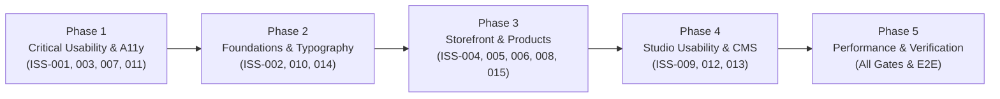

# RivyaLivingArt — Phased UI/UX Improvement Plan

**Document Status:** Pending Owner Review & Approval Prior to Execution  
**Target:** Storefront (`www.rivyalivingart.com`) & Staff Studio (`/studio`)  
**Basis:** 15 Evidence-Grounded Audit Findings from `ISSUE-BACKLOG.csv`  

---

## Overview of Improvement Phases

---

## Phase 1: Critical Usability & Accessibility Remediation

**Focus:** Immediate fixes to keyboard navigation, form error accessibility, search modal interaction, and responsive navigation density.

| Parameter | Specification |
| :--- | :--- |
| **Target Issues** | `ISS-001` (Header link density), `ISS-003` (Form error announcements), `ISS-007` (Search auto-focus & dismiss), `ISS-011` (Focus ring contrast) |
| **Affected Files** | `src/components/shop/header.tsx`, `src/components/shop/shop.module.css`, `src/components/shop/order-form.tsx`, `src/app/globals.css` |
| **Tasks** | 1. Refactor desktop header breakpoint to trigger mobile drawer at 980px or reduce intermediate desktop gap. 2. Add `role="alert"` and `aria-live="assertive"` to order form error summary container, with `aria-describedby` on invalid fields. 3. Add `autoFocus` to search input upon dialog open and add a 48px touch-dismiss backdrop buffer. 4. Apply uniform `outline: 2px solid var(--focus-on-dark); outline-offset: 4px;` across all interactive card links. |
| **Acceptance Criteria** | 1. Screen readers announce submission errors immediately upon failed form submission. 2. Header links maintain $\ge 20\text{px}$ padding and no collision between 781px and 1050px. 3. Search input is focused immediately upon dialog trigger. 4. 100% of interactive cards display crisp `#E6BA85` focus rings on keyboard Tab navigation. |
| **Regression Checks** | `npm run typecheck`, `npm test` (190 tests), runtime header check at 390px, 768px, 1440px. |

---

## Phase 2: Shared Design Foundations & Typography

**Focus:** Establishing strict 12px mobile readability floor, fine-tuning responsive image sizes attributes, and refining mobile footer layouts.

| Parameter | Specification |
| :--- | :--- |
| **Target Issues** | `ISS-002` (Mobile font floor), `ISS-010` (Next.js image sizes), `ISS-014` (Footer legal links) |
| **Affected Files** | `src/styles/tokens.css`, `src/components/shop/shop.module.css`, `src/components/shop/image-sizes.ts` |
| **Tasks** | 1. Enforce minimum 12px computed font size across all small labels, badges, and card subtitles. 2. Calibrate `sizes` string in `image-sizes.ts` to match actual CSS rendered widths at 768px and 1024px tablet viewports. 3. Reorganize `.footerBottom` on viewports under 380px into a full-width vertical stack with minimum 44px tap targets. |
| **Acceptance Criteria** | 1. No text node renders below 12px across any viewport. 2. Responsive image requests on tablet download accurately sized image derivatives. 3. Footer links are touch-friendly without horizontal clipping on 360px screens. |
| **Regression Checks** | `npm run test:runtime` (image fallback tests), full visual reflow test at 360px and 390px. |

---

## Phase 3: Storefront Templates & Product Presentation

**Focus:** Customization stepper responsiveness, tablet curated grid density, room-scale visual indicators, and WhatsApp clipboard fallback.

| Parameter | Specification |
| :--- | :--- |
| **Target Issues** | `ISS-004` (Mobile stepper), `ISS-005` (Tablet curated grid), `ISS-006` (Product scale context), `ISS-008` (Category rows wrapping), `ISS-015` (Manual copy button) |
| **Affected Files** | `src/components/shop/order-form.tsx`, `src/components/shop/shop-site.tsx`, `src/components/shop/shop.module.css`, `src/components/shop/saved-order-actions.tsx` |
| **Tasks** | 1. Implement a compact single-line stepper ("Step 1 of 4") for screens under 420px. 2. Add 2-column tablet intermediate layout for `.curatedGrid` between 780px and 1024px. 3. Introduce architectural scale badge and dimension reference diagram in product specifications. 4. Refactor `.categoryRow` into flexible 2-tier layout for screens under 400px. 5. Add one-tap "Select All" button to manual copy fallback textarea in WhatsApp handoff. |
| **Acceptance Criteria** | 1. Stepper stays clean and single-line on 360px viewport. 2. Curated grid displays balanced 2-column layout on iPad portrait. 3. Category rows wrap without clipping the arrow icon. 4. Customers can select and copy brief in two taps when clipboard API is restricted. |
| **Regression Checks** | `npm run build`, `npm test`, isolated inquiry order workflow test. |

---

## Phase 4: Studio Usability & Content-Editing Gaps

**Focus:** Sticky rich-text editor toolbar, touch drag affordance in Kanban, and accessible keyboard form question reordering.

| Parameter | Specification |
| :--- | :--- |
| **Target Issues** | `ISS-009` (Sticky editor toolbar), `ISS-012` (Touch drag affordance), `ISS-013` (Keyboard question reorder) |
| **Affected Files** | `src/components/studio-content.module.css`, `src/components/studio-private.css`, `src/components/studio-form-builder.tsx` |
| **Tasks** | 1. Make Tiptap formatting toolbar sticky (`position: sticky; top: var(--header-height);`) with blurred background on laptop viewports. 2. Add active elevated shadow and haptic card lift when touch drag begins on mobile/tablet displays. 3. Implement accessible "Move Up" and "Move Down" keyboard actions in the Studio question schema builder. |
| **Acceptance Criteria** | 1. Formatting toolbar remains visible throughout long article edits on small laptops. 2. Touch dragging on iPad provides instantaneous visual elevation. 3. Form question tree can be fully reordered using keyboard Tab and Enter/Space keys. |
| **Regression Checks** | Studio isolated test suite (`tools/release-qa/studio.mjs`), permissions check, revision history check. |

---

## Phase 5: Responsive Refinement, Performance & Final Sign-Off

**Focus:** Full 6-viewport automated verification, Core Web Vitals audit, and production release readiness.

| Parameter | Specification |
| :--- | :--- |
| **Target Scope** | Comprehensive regression validation across all 51 routes. |
| **Verification Tools**| `npm run lint`, `npm run typecheck`, `npm test`, `npm run test:preflight`, `npm run build`, `npm run test:runtime` |
| **Tasks** | 1. Run ESLint 9 checks to confirm 0 errors / 0 warnings. 2. Validate strict TypeScript compilation across all 43 app routes. 3. Verify 100% pass rate across all 190 unit and integration tests. 4. Verify 12/12 codex preflight security checks. 5. Perform full Next.js production build. 6. Execute all 386 HTTP runtime tests against local server. 7. Confirm non-transactional integrity and byte-identical preservation of master assets. |
| **Acceptance Criteria** | All 6 automated quality gates pass with zero regressions; full audit sign-off achieved. |

---

## Safety & Operational Guardrails

1. **Non-Transactional Integrity:** Under no circumstances will payment gateways, shopping carts, or customer login accounts be introduced.
2. **WhatsApp Architecture:** Retain strictly customer-initiated manual dispatch of database-saved briefs.
3. **Asset Protection:** Master visual assets (`public/media/concepts/riverline.avif` and `basin.avif`) remain byte-identical.
4. **Owner Authorization:** No changes to application code will be executed until the owner explicitly approves this plan.
