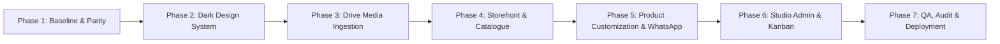

# RivyaLivingArt — Master System Prompt & Phased Redesign Plan

**Prepared for:** Bhavya Gondaliya · **Date:** 26 September 2026 · **Status:** `PLAN READY — AWAITING PHASE 1 APPROVAL`

---

## Part 1: The Master System Prompt

*Copy and utilize this comprehensive prompt for guiding AI agents and engineering leads across all execution phases.*

```text
Role & Objective:
You are an elite Full-Stack Architect, Digital Art Director, and UI/UX Engineer specializing in luxury e-commerce and Awwwards-winning editorial design. Your objective is to execute a comprehensive, high-end redesign and functional upgrade of the RivyaLivingArt platform (Main Website and Studio Admin). You will unify the best elements of the current codebase and legacy reference site under a bespoke Full Dark Theme while strictly adhering to our non-transactional, WhatsApp-concluded atelier business model.

Core Repositories & Environments:
- Production Base & Target: https://github.com/rivyalivingart2/RivyaLivingArt2.0.git
- Current Live Storefront: https://www.rivyalivingart.com/ | Studio: https://www.rivyalivingart.com/studio
- Legacy Reference / Feature Donor: https://github.com/rivyalivingart2/OLDWEBSITE.git
- Legacy Live Preview: https://oldwebsite-one.vercel.app/ | Studio: https://oldwebsite-one.vercel.app/studio/
- Media Master Assets: Google Drive: https://drive.google.com/drive/folders/1P2HCTmPge6HsEwtoo-xGEzPTSn68oZOW?usp=drive_link

1. Design & Aesthetic Specifications:
- Theme: Strict, atmospheric Full Dark Theme across 100% of routes (storefront, product catalogue, forms, policies, Studio Admin, tables, modals, dialogs). Zero light islands or unstyled components.
- Primary Color Palette:
  * Primary Green Anchor: #101713 (Legacy Forest Dark Green)
  * Primary Blue Anchor: #08111D (New Midnight Dark Blue)
  * Supporting Forest: #19221C
  * Primary Brand Gradient: linear-gradient(135deg, #101713 0%, #08111D 100%)
  * Hover Brand Gradient: linear-gradient(135deg, #19221C 0%, #112033 100%)
  * Luxury Accent: Warm Metallic Bronze (#B79270 / #CEAC89)
  * Core Typography: Off-White (#F3EFE7) for high-contrast readability; Soft Sage/Silver (#B7BFB5) for secondary metadata.
- Design Benchmarks: Emulate the spatial calm, material texture, editorial typography, and micro-interactions of:
  * era-residence.com (architectural scale, editorial pacing)
  * spykercars.com (cinematic craft, material focus)
  * aoiofficial.com (paired object and detail presentation)
  * mdebeauty.com (structured material/ingredient explanations)
  * storeyarchitecture.co.uk (spatial project briefs, room-scale context)
  * Awwwards e-commerce benchmarks (Ekomia, Case Furniture).
- Content & Copy Integrity: 100% unique, professional copy tailored to bespoke resin spatial art, river tables, botanical preservation, and heirloom gifting. Strictly NO lorem ipsum or placeholder text. Keep truthful "design visualization" disclosures where physical pieces are bespoke concepts.

2. Technical Architecture & Upgrades:
- Navigation & Header: Rebuild the header to resolve legacy sizing and contrast defects. Provide a fixed/scrolling glassmorphism bar (76–80px desktop, 64–72px mobile) with high-contrast navigation links, accessible focus states, and minimum 44px touch targets.
- Product Customization Engine: Replace demo forms with product-specific customization schemas (dimensions, resin transparency/tint, live-edge wood species, base metals, installation/access requirements).
- Studio Admin Overhaul: Rebuild the administrative dashboard with full dark theming (#101713 / #112033), a drag-and-drop + keyboard-accessible Kanban management system (New -> Contacted -> Qualified -> Quoted -> Confirmed -> In Production -> Completed -> Closed), staff assignment, and private reference viewers.
- Responsive Performance: Mobile-first responsive grid (12 cols desktop, 6 tablet, 4 mobile) with no horizontal overflow, responsive WebP/AVIF media with reserved aspect ratios, and Core Web Vitals targets (LCP <= 2.5s, CLS <= 0.1).

3. Operational & Business Compliance (Strict Boundaries):
- Non-Transactional Model: Strictly NO payment gateways (Stripe, Razorpay, etc.), NO shopping carts, and NO customer account/login systems.
- Canonical Order Flow: User customizes product -> Submits request -> Atomic server validation & database save in Studio -> System generates structured order snapshot -> User receives receipt with "Open WhatsApp" and "Copy Brief" -> Customer manually sends pre-filled message to atelier.
- Privacy & Reference Security: Private customer reference images remain private in Blob storage; never expose unauthenticated public URLs.

4. Execution Protocol:
- Phase-Wise Approach: Execute strictly in sequential phases. Update documentation and verify quality gates at each checkpoint before proceeding.
- Testing & Verification: All changes must pass TypeScript typecheck (0 errors), ESLint (0 errors), unit tests, runtime HTTP tests, and Next.js production build (`npm run build`).
```

---

## Part 2: Phased Implementation Plan



### Phase 1: Baseline Audit, Repository Parity & Contract Reconciliation (DT-01 / DT-02)

#### Objectives:
Establish the unified source baseline by auditing the production codebase (`RivyaLivingArt2.0`) and legacy reference (`OLDWEBSITE`), ensuring zero regression on previously completed security, erasure, and retention contracts.

#### Tasks:
1. **Repository Synchronization & Inventory:**
   - Confirm active branch `main` at `3c88c24` as the authoritative base.
   - Cross-reference file structure between `RivyaLivingArt2.0` and `OLDWEBSITE` to finalize the selective feature donor list (`legacy-parity.csv`).
2. **Contract Preservation Audit:**
   - Verify that recent compliance implementations remain intact:
     * Customer data erasure ledger (`rivya_erasure_ledger`) and blob deletion engine (`src/lib/data-erasure.ts`).
     * 7-day managed export expiry tracking (`rivya_managed_exports`).
     * Validated legacy provider constraint (`rivya_references_vercel_only`).
     * Asia/Kolkata timezone boundary handling (`src/lib/business-time.ts`).
3. **Database & Schema Baseline:**
   - Reconcile database tables (`rivya_catalogue`, `rivya_content`, `rivya_public_media`, `rivya_inquiries`, `rivya_studio_orders`, `rivya_privacy_controls`). Ensure migration privileges stay segregated from runtime.

#### Deliverables & Exit Criteria:
- Completed baseline audit report.
- Zero breaking changes to existing database schema or data models.
- Formal sign-off on the Phase 1 implementation roadmap.

---

### Phase 2: Foundational Design System & Theming Engine (DT-03)

#### Objectives:
Build the unified "Forest × Midnight Atelier" CSS/Tailwind theming engine across the application, delivering consistent dark tokens, responsive typography, glassmorphism overlays, and a brand-new global header and footer.

#### Tasks:
1. **Design Tokens & Global CSS Engine (`src/styles/tokens.css`, `src/app/globals.css`):**
   - Implement the exact color palette variables:
     * `--brand-forest: #101713`
     * `--brand-midnight: #08111D`
     * `--forest-raised: #19221C`
     * `--surface-ground: #111D22`
     * `--surface-elevated: #1D2D33`
     * `--studio-panel: #112033`
     * `--text-primary: #F3EFE7`
     * `--text-secondary: #B7BFB5`
     * `--accent-bronze: #B79270`
     * `--accent-bronze-hover: #CEAC89`
     * `--border-structural: #465466`
     * `--border-control: #8B96A3`
     * `--control-surface: #122336`
     * `--focus-ring: #E6BA85`
   - Define utility classes in Tailwind/CSS for the primary gradient:
     `bg-gradient-to-br from-[#101713] to-[#08111D]` and hover variants.
2. **Typography & Font Optimization:**
   - Configure **Instrument Serif** for luxury editorial display headings (`clamp(42px, 6vw, 88px)`).
   - Configure **DM Sans** for crisp, highly legible UI labels, body copy, and data tables.
   - Configure **JetBrains Mono** strictly for identifiers, references, timestamps, and order codes.
3. **Redesigned Global Header (`src/components/shop/header.tsx`):**
   - Set fixed height to 76–80px on desktop and 64–72px on mobile.
   - Implement subtle glassmorphism backdrop-blur (`backdrop-blur-md bg-[#101713]/85`) that compresses slightly on scroll.
   - Eliminate text wrapping defects and navigation collision at 125%–150% browser zoom.
   - Ensure all touch targets meet or exceed 44 × 44px with visible focus rings (`#E6BA85`).
   - Add primary CTA button: "Begin a Piece" routing to `/commission` or catalogue.
4. **Unified Dark Footer (`src/components/shop/footer.tsx`):**
   - Port essential navigation from legacy footer: 3 core collections, craftsmanship links, atelier location (Surat, Gujarat), factual contact numbers (`+91 83204 04132`), and legal policy links.
   - Strict removal of any generic WhatsApp floating buttons or automated newsletter popups.

#### Deliverables & Exit Criteria:
- Verified token contrast ratios: Normal text on `#08111D` >= 15:1; control borders >= 5:1.
- Flawless responsive header and footer rendering on mobile (360px), tablet (768px), and desktop (1440px).

---

### Phase 3: Media Ingestion & Asset Pipeline (DT-04)

#### Objectives:
Ingest, optimize, and map master photography and video loops from the provided Google Drive repository into the local public media pipeline without degrading performance or cropping product dimensions.

#### Tasks:
1. **Google Drive Asset Audit & Ingestion:**
   - Audit the Drive repository (`assets/`, `images/`, `videos/`, `Rivya_All_Generated_Images/`).
   - Deduplicate multiple exports and select the highest-fidelity WebP/AVIF versions.
2. **Asset Manifest Mapping (`docs/redesign/asset-manifest.csv`):**
   - Map assets to specific UI slots:
     * Hero Film Loop: `hero-pour-loop-web.mp4` / WebM with `hero-pour-loop-poster.jpg` fallback.
     * Material Chapter: `pour-swirl-loop-web.mp4` + high-resolution macro resin stills.
     * Collection Doorway Cards: 3 distinct portrait cards (`doorway-collectible`, `doorway-memory`, `doorway-gifts`).
     * Craft & Maker Story: Handcrafted finishing and wood-selection stills.
     * Product Primary & Gallery Media: 120 validated product images with 4:5 aspect ratio preservation.
3. **Responsive Image Component & Performance Optimization:**
   - Optimize Next.js `<Image />` configurations with exact `sizes` attributes for responsive breakpoints.
   - Apply CSS `object-fit: cover` with custom focal points to eliminate subject clipping.
   - Implement graceful dark fallback frames (`#111D22`) during image loading or network interruptions.

#### Deliverables & Exit Criteria:
- All 120 catalogue items linked to verified imagery.
- Zero broken images across the site; true LCP image prioritized with `fetchpriority="high"`.
- Total hero image payload <= 250KB mobile / <= 450KB desktop.

---

### Phase 4: Main Website Revamp & Awwwards-Level Polish (DT-05 / DT-08)

#### Objectives:
Rebuild every public-facing storefront page using the new dark aesthetic, spatial editorial layouts, subtle CSS micro-interactions, and 100% unique brand copy.

#### Tasks:
1. **Homepage Revamp (`src/app/page.tsx`):**
   - **Hero Section:** Ambient pour film / high-res still with tall serif typography: *"Living Art Born of Liquid Resin & Ancient Grain."*
   - **The Three Worlds (Doorways):** Distinct editorial feature cards for (1) Collectible Furniture, (2) Botanical & Memory Art, and (3) Personalized Heirloom Gifts.
   - **Featured Pieces:** Curated horizontal showcase with smooth hover elevation (scale <= 1.025).
   - **Material & Craft Chapter:** Interactive split layout illustrating resin clarity, organic live edges, and brass inlays.
   - **Bespoke Commission Invitation:** Atmospheric section inviting architectural and custom spatial commissions.
2. **Collection Pages (`src/app/[collection]/page.tsx`):**
   - Specific journeys for `/collectible-design` (furniture-first), `/memory-art` (preservation-first), and `/personal-art` (gifts-first).
   - Sticky category filters with active indicators and responsive layout toggles (grid / editorial list).
3. **Product Detail Page (`src/app/pieces/[slug]/page.tsx`):**
   - High-impact split layout: sticky product gallery (primary, in-situ room context, macro detail) on desktop, smooth swipeable carousel on mobile.
   - Comprehensive specifications: wood species, resin grade, dimensions, weight, seating/display capacity, lead times, and Surat delivery details.
   - Prominent action button: "Customize this Piece" routing to `/pieces/[slug]/customize`.
4. **Brand, Editorial & Architecture Pages:**
   - `/our-story` / `/about`: Honest atelier origin story, artisanal philosophy, Surat studio details.
   - `/process`: Step-by-step bespoke workflow (Consultation -> Slab Selection -> Resin Pour -> Curing & Hand-Polishing -> White-Glove Installation).
   - `/materials-care`: Care guides for solid wood, UV-stable resin maintenance, scratch protection, and heat avoidance.
   - `/architects`: Dedicated portal for interior designers and spatial architects requesting commercial installations.
   - `/journal` & `/journal/[slug]`: 36 editorial design stories with high-contrast typography (64–72ch line measure).
   - `/faq` & `/contact`: Categorized accordion FAQs and verified contact details with interactive Google Maps link.
5. **Legal & Compliance Pages:**
   - `/shipping-delivery`, `/returns-cancellations`, `/privacy`, `/terms`, `/accessibility` aligned with approved Indian policies.

#### Deliverables & Exit Criteria:
- All 43+ public routes fully rendered in the dark theme.
- Zero lorem ipsum; all typography contrast ratios pass WCAG AA standards.
- Reduced-motion accessibility supported across all animations.

---

### Phase 5: Product Customization & WhatsApp Workflow (DT-06)

#### Objectives:
Replace generic demo forms with tailored, product-specific customization forms, securely persist request data to the database, and route the customer into WhatsApp with a complete, structured brief.

#### Tasks:
1. **Product-Specific Form Engine (`src/components/shop/order-form.tsx`):**
   - Furniture pieces: Width, length, height options; wood slab selection (Teak, Walnut, Rosewood, Acacia); resin hue/transparency; leg finish (powder-coated steel, brass, acrylic); installation requirements.
   - Memory & Preservation pieces: Flower type (varmala, bridal bouquet, anniversary bloom); frame geometry; inclusion elements; sentimental engraving text.
   - Personal gifts: Custom monogram/name inputs with real-time character bounds.
2. **Private Reference Uploads (`src/app/api/inquiry/reference/route.ts`):**
   - Allow customer to attach reference imagery (room photos, flower photos, space dimensions).
   - Validate file type (JPEG/PNG/WebP), size (<= 15MB), and dimensions server-side.
   - Store securely in private storage; link reference count to the order.
3. **Atomic Persistence & Order Receipt (`src/app/actions/inquiry.ts`):**
   - Save order to PostgreSQL database (`rivya_inquiries`, `rivya_studio_orders`) with a unique alphanumeric reference (e.g., `RLA-C295DF24A677`).
   - Retain complete JSON snapshot of all customization answers, timestamp, and guest session hash.
4. **WhatsApp Handoff Mechanism (`src/components/shop/saved-order-actions.tsx`):**
   - Generate structured, highly readable WhatsApp message:
     ```text
     *RivyaLivingArt — Customization Request*
     Order Ref: RLA-C295DF24A677
     Item: River Channel Console Table
     Dimensions: 1800mm x 450mm x 850mm
     Wood Selection: Reclaimed Teakwood
     Resin Style: Deep Emerald Translucent
     Base: Hand-brushed Antique Brass
     City / Delivery: Surat, Gujarat
     Attached References: 2 images saved
     
     Hello, I have submitted my design request on your website. Please review the details and provide a quotation.
     ```
   - Render the order receipt page (`/inquiry/received`) with two explicit buttons:
     1. **"Open WhatsApp"**: Triggers `window.open("https://wa.me/918320404132?text=...")`.
     2. **"Copy Order Brief"**: Copies formatted text to clipboard with toast confirmation.
   - Explain clearly: *"This submits a request for quotation; no payment is charged online."*

#### Deliverables & Exit Criteria:
- Customization answers accurately stored in database before any WhatsApp action.
- WhatsApp message formatting tested with non-Latin characters and long strings.
- Full idempotency: double-submitting or page refreshing does not duplicate database orders.

---

### Phase 6: Studio Admin Dashboard & Kanban Overhaul (DT-07)

#### Objectives:
Modernize the staff Studio interface into a compact, dark-themed operational command center featuring a real-time Kanban pipeline, customer reference inspection, and full CMS editorial controls.

#### Tasks:
1. **Admin Theming & Navigation (`src/components/studio/workspace.tsx`):**
   - Apply deep dark theming: `#101713` sidebar, `#112033` operational panels, `#122336` table cells, `#8B96A3` borders.
   - Ensure maximum density and data readability: compact typography, high-contrast badges, zero distracting animations.
2. **Inquiry & Order Kanban Board (`src/components/studio/inquiry-board.tsx`):**
   - Interactive column workflow matching business milestones:
     `NEW` -> `CONTACTED` -> `QUALIFIED` -> `QUOTED` -> `CONFIRMED` -> `IN_PRODUCTION` -> `COMPLETED` -> `CLOSED`.
   - Card displays: Client name, inquiry ref, product title, timestamp, assignee, follow-up date badge, and reference count.
   - Dual interaction: Smooth HTML5 drag-and-drop between columns + accessible "Move to Stage" dropdown for keyboard/touch.
   - Concurrency control: Record version validation prevents accidental overwrites when multiple staff are active.
3. **Inquiry Detail Drawer & Private Reference Viewer:**
   - View complete decoded customer customization answers and notes.
   - Integrated private reference viewer (`/studio/reference/[id]`) with authenticated streaming (prevents public web leakage).
   - Staff assignment selector and follow-up date scheduler configured for `Asia/Kolkata` timezone.
   - Integrated privacy controls: Customer identity verification and permanent data erasure engine (CR-04/18).
4. **Catalogue & CMS Editorial Hub:**
   - Product manager: Edit pricing notes, specifications, custom form fields, and image associations.
   - Content workspace: Draft, preview, and publish journal articles, FAQs, care guides, and portfolio project studies.

#### Deliverables & Exit Criteria:
- Kanban stage changes immediately persist to database with audit log entry.
- Role-based access control verified: Editors restricted to assigned inquiries; Admins have full access.
- Private references securely accessible only by authenticated staff.

---

### Phase 7: Verification, Performance QA & Production Deployment (DT-09 / DT-10 / DT-11)

#### Objectives:
Execute rigorous cross-device audits, Core Web Vitals profiling, automated test suites, accessibility checks, and deploy the production-ready build to GitHub and Vercel.

#### Tasks:
1. **Comprehensive Test Suite Execution:**
   - `npm run lint`: Verify 0 errors.
   - `npm run typecheck`: Verify 0 TypeScript errors.
   - `npm test`: Execute all unit checks (including data erasure, timezone boundaries, and security contracts).
   - `npm run test:preflight`: Verify 12/12 preflight checks.
   - `npm run build`: Confirm clean compilation of all 43+ routes.
   - `npm run test:runtime`: Verify 386/386 HTTP endpoint security tests.
2. **Cross-Device & Accessibility Audit:**
   - Test responsive viewports: 320px, 375px, 430px (iPhone), 768px (iPad), 1024px, 1440px, 1920px.
   - Audit color contrast: Ensure all body text exceeds 4.5:1 and large text exceeds 3:1 against dark backgrounds.
   - Verify keyboard navigability: Focus rings visible on all links, buttons, and form inputs; modal traps functional.
3. **Performance & Core Web Vitals Profiling:**
   - Verify LCP <= 2.5s, CLS <= 0.1, INP <= 200ms.
   - Confirm search indexing remains strictly disabled (`Disallow: /`) in `robots.txt` until owner authorization.
4. **Final Release & Documentation:**
   - Commit all production code to the Git repository.
   - Verify remote Vercel Preview and Production deployments.
   - Generate release receipt and maintain `docs/redesign/DARK-THEME-MASTER-PLAN.md`.

#### Deliverables & Exit Criteria:
- 100% automated test pass rate.
- Verified production build deployed to Vercel.
- Complete documentation and operational runbook delivered.

---

## Part 3: Approval Request

> [!IMPORTANT]
> **Phase 1 Approval Required:**
> Please review this comprehensive implementation plan. Once you confirm and approve, development will proceed autonomously starting with **Phase 2: Foundational Design System & Theming Engine**.
