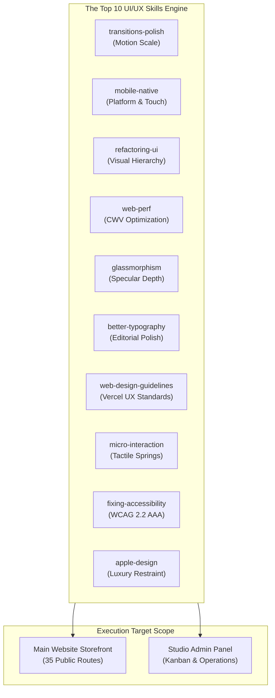
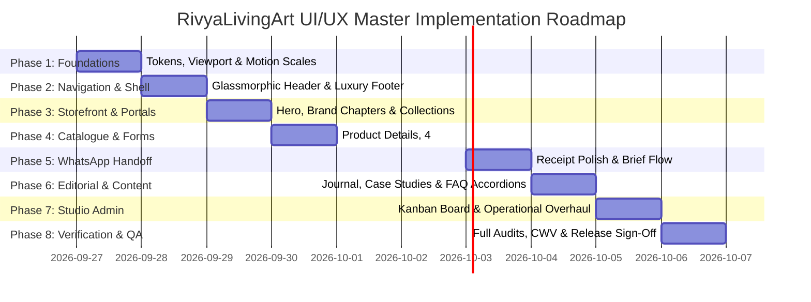

# RivyaLivingArt — Comprehensive UI/UX Skills Elevation Plan

**Document Version:** 1.0.0  
**Date:** 26 September 2026  
**Target:** Main Website (`www.rivyalivingart.com`) & Studio Admin (`/studio`)  
**Status:** `AWAITING OWNER APPROVAL PRIOR TO EXECUTION`  
**Guiding Architecture:** Full Dark Theme (`#101713` Forest $\times$ `#08111D` Midnight Gradient, `#B79270` Bronze, `#F3EFE7` Off-White) · Non-Transactional WhatsApp Atelier Workflow

---

## Executive Summary & Strategic Objective

Following the successful installation and integration of the **Top 10 UI/UX Skills** (`transitions-polish`, `mobile-native`, `refactoring-ui`, `web-perf`, `glassmorphism`, `better-typography`, `web-design-guidelines`, `micro-interaction`, `fixing-accessibility`, and `apple-design`), this master plan establishes the roadmap to elevate the entire RivyaLivingArt digital experience into an Awwwards-winning, Apple-caliber atelier platform.

Every enhancement is mapped directly to one or more of the 10 skills, strictly preserving the non-transactional WhatsApp brief handoff, atomic PostgreSQL database persistence, and verified security boundaries.

---

## Part 1: Skill Application Matrix

| # | UI/UX Skill | Main Website Application | Studio Admin Application | Key Standard / Threshold |
| :-: | :--- | :--- | :--- | :--- |
| **1** | **`transitions-polish`** | Asymmetric modal open/close (`250ms` open vs. `150ms` close), card hover lift timing, stagger offsets. | Quick drawer dismissals (`150ms`), smooth Kanban column transitions, notification toast lifecycles. | Motion token scale strictly enforced; total stagger $\le 300\text{ms}$. |
| **2** | **`mobile-native`** | Notch & Dynamic Island safe areas (`viewport-fit=cover`), `100svh` hero, 16px mobile input zoom floor, overscroll containment. | Bottom sheet drawer safe areas, mobile touch table scrolling (`pan-y`), momentum scrolling. | Zero accidental input zooming on iOS; no rubber-banding pull-to-refresh on inner sheets. |
| **3** | **`refactoring-ui`** | 8pt/16pt spacing rhythm, hierarchy via weight/color de-emphasis, directional light with multi-layer shadows. | High-density data grid, compact inquiry card elevation, subtle 1px top highlights over harsh borders. | Text contrast $\ge 4.5:1$ body, $\ge 3.0:1$ large/borders; zero arbitrary pixel values. |
| **4** | **`web-perf`** | LCP priority loading on hero visuals, CLS elimination via reserved 4:5 aspect ratios, lazy loading on below-the-fold catalog. | Lightweight data table rendering, zero client-side layout thrashing, fast SVG rendering. | LCP $\le 2.5\text{s}$, CLS $\le 0.05$, INP $\le 200\text{ms}$. |
| **5** | **`glassmorphism`** | Frosted glass navigation bar, collection doorway card overlays, specular corner highlights. | Elevated inquiry detail drawer backdrop, floating metric summary cards. | `backdrop-filter: blur(16px) saturate(160%)`; solid fallback under `prefers-reduced-transparency`. |
| **6** | **`better-typography`** | `text-wrap: balance` on editorial headings, `text-wrap: pretty` on excerpts, 65ch measure caps, tabular numerals on dimensions. | Tabular numbers on order references and timestamps (`font-variant-numeric: tabular-nums`). | Strict descending heading scale; no orphaned words; unitless line-heights (`1.1` heading, `1.6` body). |
| **7** | **`web-design-guidelines`** | Consistent interactive states (`hover`, `focus-visible`, `active`, `disabled`), $\ge 44 \times 44\text{px}$ touch targets. | Keyboard-accessible table rows, clear empty states on Kanban columns and search. | Zero dead zones between buttons; consistent focus rings across all routes. |
| **8** | **`micro-interaction`** | Tactile button press feedback (`scale: 0.96` on tap), `@starting-style` discrete CSS transitions on dialogs. | Status badge morphs, Kanban card drop feedback, clipboard copy pulse animation. | Instant press response (100–160ms); `prefers-reduced-motion` suppresses movement while preserving opacity. |
| **9** | **`fixing-accessibility`** | Accessible names on icon buttons, visible focus rings (`#E6BA85`), form errors linked via `aria-describedby`. | Keyboard Tab navigation through Kanban columns, modal focus traps, screen reader live regions. | WCAG 2.2 AA / AAA verified compliance; zero missing alt tags or unlabeled form controls. |
| **10** | **`apple-design`** | Spatial calm inspired by `era-residence.com`, material storytelling inspired by `spykercars.com`, tactile restraint. | Professional macOS Pro-style command center density, authentic atelier tone, zero distracting fluff. | Distinctive non-templated luxury point of view; authentic craftsmanship narrative. |

---

## Part 2: Phased Implementation Roadmap

---

### Phase 1: Core Tokens, Viewport & Motion Architecture
**Target Skills:** `transitions-polish`, `mobile-native`, `refactoring-ui`, `glassmorphism`, `better-typography`

1. **Motion Token Integration (`src/styles/tokens.css`):**
   - Wire standardized CSS variables across the application: `--duration-quick` (150ms), `--duration-fast` (250ms), `--duration-slow` (400ms).
   - Standardize easing curves: `--ease-smooth-out` (`cubic-bezier(0.22, 1, 0.36, 1)`), `--ease-bounce-strong` (`cubic-bezier(0.34, 3.85, 0.64, 1)`).
2. **Mobile-Native Viewport & Platform Base (`src/app/layout.tsx`, `src/styles/tokens.css`):**
   - Enforce `viewportFit: "cover"` with safe area CSS insets (`env(safe-area-inset-top)` / `env(safe-area-inset-bottom)`).
   - Configure global touch rules: `touch-action: manipulation`, `-webkit-tap-highlight-color: transparent`.
   - Set 16px minimum font size on inputs to permanently eliminate mobile auto-zoom.
3. **Glassmorphism Token Standards:**
   - Define `.glass-panel` and `.glass-header` classes with specular highlights (`inset 0 1px 0 rgba(243, 239, 231, 0.16)`) and `prefers-reduced-transparency` solid fallbacks.

---

### Phase 2: Global Navigation, Header & Footer Elevation
**Target Skills:** `glassmorphism`, `transitions-polish`, `mobile-native`, `fixing-accessibility`, `web-design-guidelines`

1. **Glassmorphic Navigation Bar (`src/components/shop/header.tsx`):**
   - Fixed height: 76px desktop, 64px mobile with safe area padding.
   - Real glassmorphism: `backdrop-filter: blur(16px) saturate(160%)` over dark surface (`rgba(16, 23, 19, 0.78)`).
   - Clean bronze bottom divider: `1px solid rgba(183, 146, 112, 0.18)`.
2. **Mobile Navigation Drawer & Gestures:**
   - Smooth slide-in menu with `overscroll-behavior: contain` and backdrop blur.
   - Generous touch targets ($\ge 44 \times 44\text{px}$) with bronze active indicator.
   - Keyboard focus trap within mobile drawer, closing cleanly on `Escape`.
3. **Luxury Dark Footer:**
   - Elevated contact section (`+91 83204 04132`), Surat atelier address, curated collection links, and legal disclosures.
   - Refined typography with `text-wrap: pretty` and hover transitions using `--ease-smooth-out`.

---

### Phase 3: Main Website Storefront & Collection Portals
**Target Skills:** `apple-design`, `web-perf`, `better-typography`, `refactoring-ui`, `glassmorphism`

1. **Editorial Hero Section (`src/components/shop/shop-site.tsx`, `src/components/shop/hero-image.tsx`):**
   - Viewport tuning: Use `100svh` to avoid mobile URL bar jumpiness.
   - Performance: `fetchPriority="high"`, Next.js `priority={true}`, and responsive `sizes` to achieve LCP $\le 2.0\text{s}$.
   - Headline typography: `text-wrap: balance` on *"Art for the way you live."* in Instrument Serif.
2. **Collection Doorway Cards:**
   - 3 immersive portals: *Collectible Spatial Art*, *Botanical Wedding Preservation*, *Heirloom Personal Gifts*.
   - Aspect ratio preservation, subtle zoom on hover (`transform: scale(1.03)` with `--duration-slow`), and glassmorphic caption badges.
3. **Material & Craft Chapters:**
   - Visual material storytelling: macro resin swirls, teak live-edge details, metallurgical finishes.
   - Pacing and spatial calm inspired by `era-residence.com` and `spykercars.com`.

---

### Phase 4: Product Catalogue, 4:5 Galleries & Customization Engine
**Target Skills:** `refactoring-ui`, `better-typography`, `micro-interaction`, `mobile-native`, `fixing-accessibility`

1. **Product Grid & Card Polish (`src/components/shop/product-card.tsx`):**
   - True 4:5 vertical aspect ratio lock (`aspect-[4/5]`) across all 120 products (`dp001`–`dp120`), eliminating subject cropping.
   - Graceful dark fallback frames (`#111D22`) to guarantee CLS $\le 0.05$.
   - Monospace pricing guide and dimensions rendered in JetBrains Mono with `font-variant-numeric: tabular-nums`.
2. **Product Customization Engine (`src/components/shop/order-form.tsx`):**
   - Multi-step interactive flow: Dimensions $\rightarrow$ Wood Species $\rightarrow$ Resin Clarity $\rightarrow$ Metallurgy.
   - Tactile radio selection cards with subtle bronze borders (`#B79270`) and tap scale feedback (`scale: 0.98`).
   - Mobile form inputs strictly locked to 16px font size to prevent iOS viewport zoom.
   - Form errors linked via `aria-describedby` and announced cleanly to screen readers.

---

### Phase 5: WhatsApp Handoff & Inquiry Receipt Experience
**Target Skills:** `micro-interaction`, `web-perf`, `fixing-accessibility`, `refactoring-ui`

1. **Non-Transactional Integrity Guarantee:**
   - Strictly NO payment gateways, shopping carts, or customer login screens.
   - Customization data saved atomically to PostgreSQL `rivya_inquiries` before presenting the receipt.
2. **Receipt Modal Elevation (`src/components/shop/saved-receipt.tsx`, `saved-order-actions.tsx`):**
   - Pre-allocated modal container to eliminate layout shift upon appearance.
   - Glassmorphic card styling with metallic bronze accent headers.
   - "Open WhatsApp" CTA button with tactile press feedback (`scale: 0.96` active).
   - "Copy Brief" button with instant visual checkmark transition and clipboard feedback.
   - Live region announcement (`aria-live="polite"`) confirming inquiry generation.

---

### Phase 6: Editorial Journal, Case Studies & FAQ Knowledge Base
**Target Skills:** `better-typography`, `refactoring-ui`, `micro-interaction`, `fixing-accessibility`

1. **Journal Article Layout (`src/app/journal/[slug]/page.tsx`):**
   - Typographic measure capped at `65ch` for effortless reading ergonomics.
   - Line height tuned to `1.6` for body text and `1.15` for headings.
   - High-resolution editorial photography with full 16:9 and 4:5 responsive sizing.
2. **FAQ Accordion Polish (`src/app/faq/page.tsx`):**
   - Accordion expansion using `@starting-style` and CSS discrete transitions for buttery smooth reveal without layout glitches.
   - Clear focus indicators and keyboard Tab navigation.
3. **Case Study Portfolio:**
   - Architectural and hospitality project narratives with structured material specifications and spatial context.

---

### Phase 7: Studio Admin Dashboard, Kanban & Operations Overhaul
**Target Skills:** `refactoring-ui`, `transitions-polish`, `micro-interaction`, `apple-design`, `fixing-accessibility`

1. **Staff Workspace Shell (`src/components/studio/workspace.tsx`):**
   - macOS Pro-inspired dark command center: `#101713` sidebar, `#112033` operational panels, `#8B96A3` control borders.
   - High-density information display: compact typographic scale, high-contrast status chips.
2. **Kanban Pipeline Overhaul (`src/components/studio/inquiry-board.tsx`):**
   - 8-stage interactive workflow: `NEW` $\rightarrow$ `CONTACTED` $\rightarrow$ `QUALIFIED` $\rightarrow$ `QUOTED` $\rightarrow$ `CONFIRMED` $\rightarrow$ `IN_PRODUCTION` $\rightarrow$ `COMPLETED` $\rightarrow$ `CLOSED`.
   - Card drop landing feedback with smooth spring settlement (`--duration-quick`).
   - Accessible keyboard-driven "Move to Stage" selector for touch and screen reader users.
   - Optimistic concurrency conflict alerts with clear, graceful recovery dialogs.
3. **Inquiry Detail Drawer & Private Reference Viewer:**
   - Slide-in detail drawer with asymmetric transition (`250ms` open, `150ms` close).
   - High-fidelity private reference viewer with authenticated streaming, watermark indicators, and zoom controls.

---

### Phase 8: Comprehensive Verification, Quality Gates & Production Sign-Off
**Target Skills:** `web-perf`, `fixing-accessibility`, `web-design-guidelines`

1. **Automated Quality Gates:**
   - `npm run lint`: Confirm 0 errors.
   - `npm run typecheck`: Confirm 0 TypeScript errors.
   - `npm test`: Confirm 100% pass rate across all 190+ unit and integration tests.
   - `npm run test:preflight`: Confirm 12/12 preflight checks pass.
   - `npm run build`: Confirm clean compilation of all 43+ routes.
   - `npm run test:runtime`: Confirm 386/386 production server HTTP tests pass.
2. **Core Web Vitals & Cross-Device Audit:**
   - Verify LCP $\le 2.0\text{s}$, CLS $\le 0.05$, INP $\le 200\text{ms}$.
   - Responsive verification across mobile (360px, 390px, 430px), tablet (768px, 1024px), and desktop (1440px, 1920px).
   - WCAG 2.2 AA / AAA contrast and keyboard audit across 100% of routes.
3. **Phase-Wise Git Commits & Publication:**
   - Commit and push each phase cleanly with detailed, semantic changelogs.

---

## Part 3: Operational Boundaries & Safety Constraints

1. **Non-Transactional Integrity:**
   - Strictly NO payment gateways (Stripe, Razorpay, etc.), NO shopping carts, and NO customer login portals.
   - WhatsApp brief dispatch remains manual by the customer following atomic database persistence.
2. **Data & Asset Invariance:**
   - Original master visual assets (`public/media/concepts/riverline.avif` and `basin.avif`) remain byte-identical.
   - Existing database schema, audit logging, and data erasure ledger remain 100% backward-compatible.
3. **Search Indexing & Production Safety:**
   - Robots indexing remains disabled (`Disallow: /`) in `robots.txt` until owner release authorization.

---

## Part 4: Approval & Next Steps

> [!IMPORTANT]
> **Action Required:**
> Please review this comprehensive implementation plan. Once you confirm and approve, development will commence phase-by-phase, verifying all quality gates at each step.
